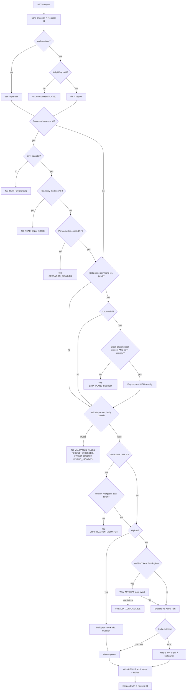
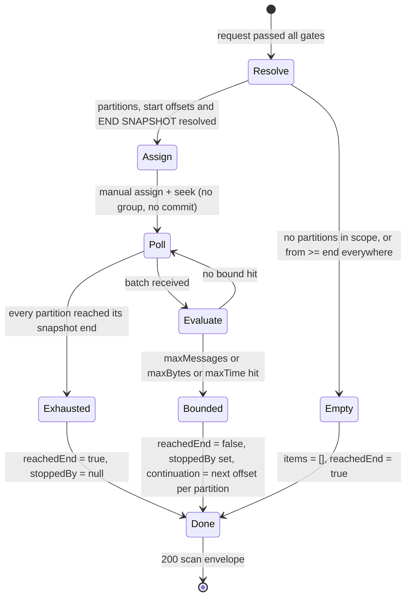

# Functional Specification

**Product:** Kafka Application Gateway
**Version:** v1 scope — revision 0.4
**Pipeline steps completed:** 1 (`skill-func-objective-scout`) · 2 (`skill-func-behavior-mapper`) · 8 (`skill-spec-auditor` — amendments, see TECH-SPEC §6) · 9 (`skill-task-creator` — diff-markup consumed into `TASKS.md`)
**Date:** 2026-09-19

---

## 1. Problem Statement

Kafka management UIs (Kafdrop and similar) each embed their own Kafka client, cluster connection configuration, and administration logic. This couples every tool to the cluster, duplicates the same logic across tools, and forces the UI tier to hold broker credentials. There is no single, stable HTTP surface through which a management application can inspect and operate a Kafka cluster.

## 2. Product Definition

The **Kafka Application Gateway** is a headless, stateless service that connects to **one** Kafka cluster and exposes its inspection, data-plane, and administration capabilities as a **versioned, documented, access-tiered REST API**, so that a Kafdrop-like front-end (or any management application) can operate the cluster over HTTP without embedding a Kafka client or holding broker credentials.

The gateway is:

- **Headless** — it has no UI of its own; UIs are separate consumers of the API.
- **Stateless** — it holds no state between requests and requires no database. Configuration is supplied at start-up.
- **A gateway, not a processor** — it forwards commands and data verbatim; it does not transform, route, or enrich messages.

## 3. Settled Product Decisions

| # | Decision | Value |
|---|---|---|
| D1 | Cluster model | One Kafka cluster per gateway instance. Routes are flat (no cluster selector). |
| D2 | Message payload formats | Values and keys are exposed as UTF-8 string, JSON, or base64-encoded bytes. No schema-aware decoding. |
| D3 | API authentication | Static API keys, each tagged with a tier: **reader** or **operator**. Authentication may be disabled by configuration for trusted networks (all callers then act as operator). No user store. |
| D4 | Replay execution model | Bounded synchronous: each call copies at most N records (configured ceiling) and returns a continuation cursor; the caller loops. No background jobs. |
| D5 | Data-plane lock bypass | Per-request break-glass: while the lock is on, an **operator** key may pass an explicit override on a single request; every override is written to the audit log at **HIGH** severity. The lock is never silently turned off at runtime. |

## 4. Measurable Objectives

| # | Objective | Verification |
|---|---|---|
| O1 | Every command in the catalog (§5) is reachable via a REST endpoint described in an OpenAPI 3 document served by the gateway itself. | 100 % of catalog commands present in the served OpenAPI document. |
| O2 | A management UI can be built against the gateway alone, with no direct broker connectivity. | Every catalog command exercised end-to-end against a live Kafka cluster using HTTP only. |
| O3 | No message read, search, or replay request can consume unboundedly. | Every such endpoint enforces max-messages, max-bytes, and max-scan-time, with defaults and a configured hard ceiling that callers cannot exceed. |
| O4 | Read operations never mutate cluster state. | Reading and searching commit no offsets and register no consumer group on the cluster. |
| O5 | Errors are uniform and machine-readable. | Every failure returns a consistent HTTP status plus an error body that preserves the underlying Kafka error code. |
| O6 | Operators can tell whether the gateway is usable. | A health endpoint reports gateway liveness and cluster reachability as separate signals. |
| O7 | Reader-tier keys can never mutate the cluster. | Every mutating endpoint (including produce) rejects reader keys; every endpoint rejects missing or invalid keys when authentication is enabled. |
| O8 | Destructive operations are deliberate and traceable. | Every destructive command (§5.6) supports dry-run, requires the caller to echo the target name, and writes an audit entry on execution. |
| O9 | Disabled operations fail loudly, not silently. | Requests blocked by read-only mode, a per-operation switch, or the data-plane lock return **403** with a machine-readable reason code — never 404. |

## 5. Command Catalog (v1 — 41 commands)

Commands are tiered by priority so implementation can be phased. **P1** is the minimum viable gateway; **P2** adds administration; **P3** adds advanced cluster operations.

**Access legend:** `R` = available to reader keys · `W` = operator keys only

### 5.1 P1 — Core Inspection & Data Plane

| ID | Command | Access | Description |
|---|---|---|---|
| C1 | Describe cluster | R | Cluster id, controller, broker list (id, host, port, rack). |
| C2 | Describe broker configuration | R | All configuration properties of a broker, with their source. |
| C3 | Gateway health & connectivity | R | Gateway liveness and cluster reachability reported separately (O6). |
| C4 | Cluster health summary | R | Under-replicated partitions, offline partitions, partitions without preferred leader, broker count. |
| T1 | List topics | R | Partition count, replication factor, internal flag. Supports name-pattern filter, include-internal toggle, pagination. |
| T2 | Describe topic | R | Partitions with leader, replicas, ISR, begin/end offsets, approximate message count; all configuration properties with source (default / static / dynamic). |
| T3 | Partition / topic on-disk size | R | Bytes per partition and per topic from broker log directories. |
| T4 | Message count in a time window | R | Per-partition and total count of messages between two timestamps. |
| M1 | Read messages | R | From one or all partitions; start at offset, timestamp, beginning, or latest-N. Returns key, value, headers, timestamp, offset, partition. Bounded per O3. |
| M2 | Fetch single message | R | One message by partition + offset (deep-linkable). |
| M3 | Search messages by regex | R | Regex over value (optionally key and headers), within an offset or timestamp window. Returns matches plus scan statistics: scanned, matched, reached-end flag, and per-partition continuation offsets. Bounded per O3. |
| M4 | Search messages by JSONPath filter | R | Field-level filter for JSON payloads, same windowing, bounds, and result shape as M3. |
| M5 | Produce message(s) | W | Key, value, headers, optional explicit partition. Single and batch. |
| M6 | Bulk produce from upload | W | NDJSON or JSON-array body of records produced in one request. |
| M7 | Send tombstone for a key | W | Null-value record so compacted topics drop the key. |
| G1 | List consumer groups | R | Group id, state, protocol type. Paginated. |
| G2 | Describe consumer group | R | Members, assignments, per-partition committed offset, end offset, lag. |
| G3 | Groups consuming a topic | R | Reverse lookup: topic → consumer groups → lag. |

### 5.2 P2 — Administration & Destructive

| ID | Command | Access | Description |
|---|---|---|---|
| T5 | Create topic | W | Name, partitions, replication factor, configuration overrides. Supports a validate-only (dry-run) flag. |
| T6 | Bulk create topics | W | JSON list of topic definitions created in one call. |
| T7 | Delete topic | W | Destructive. |
| T8 | Bulk delete topics | W | By explicit list or name pattern. Destructive. |
| T9 | Alter topic configuration | W | Set values or reset keys to default. Destructive (overwrites configuration). |
| T10 | Add partitions | W | Increase partition count. Destructive (irreversible; changes key-to-partition mapping). |
| T11 | Delete records | W | Truncate a partition to a given offset. Destructive, irreversible data loss. |
| T12 | Purge topic | W | Delete all records in every partition; topic and configuration remain. Destructive. |
| G4 | Reset consumer group offsets | W | To earliest, latest, a specific offset, or a timestamp. Requires the group to have no active members. Also pre-seeds offsets for a group that does not yet exist. Destructive. |
| G5 | Delete consumer group | W | Removes an inactive group and its committed offsets. Destructive. |
| G6 | Remove members from consumer group | W | Force-evict stuck or static members. Destructive. |
| G7 | Clone consumer group offsets | W | Copy committed offsets from group A to group B. Destructive (overwrites B). |
| M8 | Replay / copy message range | W | Copy records from a source topic offset range to a target topic verbatim, per D4 (bounded, cursor). A range of one record is a single re-drive. Destructive (writes). |
| C5 | Alter broker dynamic configuration | W | Runtime change of broker-level configuration. Destructive. |

### 5.3 P3 — Advanced Cluster Operations

| ID | Command | Access | Description |
|---|---|---|---|
| C6 | KRaft quorum status | R | Voters, leader, replication lag (KRaft clusters). |
| C7 | In-progress partition reassignments | R | Reassignments currently running on the cluster. |
| C8 | Broker disk usage per log directory | R | Bytes per broker per log directory. |
| C9 | Partition reassignment & leader election | W | Start or cancel a reassignment; trigger preferred or unclean leader election. Destructive. |
| C10 | Throughput sample | R | Messages per second per topic over N seconds, derived from two end-offset snapshots. No persistence. |
| C11 | Export topic / cluster definitions | R | JSON snapshot of topics and their configuration. |
| C12 | Import / apply topic definitions | W | Declarative reconcile of a JSON topic set against the cluster (create, alter; delete optional). Destructive when delete is enabled. |
| S1 | Manage SCRAM credentials | W | List users (no secrets), create, delete. Delete is destructive. |
| S2 | Manage client quotas | W | List and alter byte-rate / request quotas. Alter is destructive. |

### 5.4 Cross-Cutting Requirements

| ID | Requirement |
|---|---|
| X1 | The gateway serves an OpenAPI 3 document covering every endpoint (O1). |
| X2 | Uniform error envelope preserving the Kafka error code (O5). |
| X3 | Pagination on every list endpoint. |
| X4 | A request / correlation id is returned in every response and included in every log entry. |
| X5 | CORS is configurable so browser-based UIs can call the gateway directly. |
| X6 | The gateway connects to plaintext and secured (TLS / SASL) clusters via configuration. |
| X7 | Per-request bounds on all message read, search, and replay operations (O3). |
| X8 | Read operations never mutate cluster state (O4). |

### 5.5 Safety Controls

| ID | Control | Description |
|---|---|---|
| F1 | Tiered API keys | Keys are tagged reader or operator (D3). Reader keys reach `R` commands only; operator keys reach everything (O7). |
| F2 | Global read-only mode | A configuration switch that disables every `W` command. Blocked calls return 403 with a reason code (O9). |
| F3 | Per-operation switches | Each destructive command (§5.6) can be individually enabled or disabled by configuration (O9). |
| F4 | Confirmation echo + dry-run | Every destructive command requires the caller to echo the target name in the request body and supports a dry-run mode that returns what would be affected without executing (O8). |
| F5 | Audit log of mutations | Every `W` request writes a structured audit entry: operation, target, caller key id, timestamp, outcome, severity. Sinks: stdout/file; optionally also produced to a configured Kafka topic. |
| F6 | Data-plane lock | A configuration flag that blocks all message data-plane commands (M1–M8). Bypass is per-request break-glass by an operator key, audited at HIGH severity (D5, O9). |

### 5.6 Destructive Commands

A command is **destructive** when it deletes data, deletes an entity, or overwrites offsets or configuration. F3 and F4 apply to every command in this list:

T7, T8, T9, T10, T11, T12, G4, G5, G6, G7, M8, C5, C9, C12 (when delete is enabled), S1 (delete), S2 (alter).

## 6. Out of Scope — v1

| # | Excluded | Disposition |
|---|---|---|
| 1 | Any user interface | Not planned — the gateway is headless by definition |
| 2 | Multi-cluster (many clusters per instance, cluster selector in routes) | Deferred to backlog |
| 3 | Schema Registry integration; Avro / Protobuf decoding | Deferred to backlog |
| 4 | Kafka Connect, ksqlDB, MirrorMaker management | Not planned |
| 5 | Clone topic (new topic from an existing topic's configuration) | Deferred to backlog |
| 6 | ACL management and ACL listing | Deferred to backlog |
| 7 | Protected topic patterns (topics immune to delete / purge / truncate) | Deferred to backlog — declined for v1 |
| 8 | Scan concurrency limits and per-key rate limiting | Deferred to backlog — per-request bounds (O3) still apply |
| 9 | Abort transactions; list active producers / transactions | Deferred to backlog |
| 10 | Alter replica log directories; unregister broker; delegation tokens | Not planned |
| 11 | Rename topic | Not natively supported by Kafka; documented as a client-side composite (create + replay + delete) |
| 12 | Configuration key catalog / documentation endpoint | Deferred to backlog |
| 13 | Bulk alter topic configuration by pattern | Deferred to backlog |
| 14 | Live tail via WebSocket / SSE | Deferred to backlog — v1 is request/response only |
| 15 | User identity management, RBAC beyond the two key tiers, any user store | Not planned for the gateway |
| 16 | Metrics / JMX scraping | Not planned — the gateway is not a monitoring system |
| 17 | Message transformation, routing, or enrichment | Not planned — replay copies verbatim |
| 18 | Persistence of any kind (database, offset history, lag trends) | Not planned — the audit log is a log, not a queryable store |
| 19 | Asynchronous job tracking | Deferred to backlog — replay is bounded synchronous (D4) |

## 7. Handed to Later Pipeline Steps

Every item Step 1 deferred has since been decided. Ledger of where each was closed:

| Deferred item | Closed by | Where |
|---|---|---|
| Default and ceiling values for max-messages, max-bytes, max-scan-time, replay batch size N | Step 2 | §8.8 |
| Error envelope schema and reason-code taxonomy (O5, O9) | Step 2 | §8.3, §8.4 |
| Break-glass request mechanism; audit event schema and severity scale | Step 2 | §8.2 (`X-Break-Glass-Reason`), §8.5 |
| API versioning scheme | Step 2 | §8.2 (`/v1`) |
| Per-command URL structure and HTTP verbs | Step 8 audit (B1) | TECH-SPEC §6.2 |
| Encoding rules for binary keys and headers | Step 2 | §8.2 (encodings) |
| M3 / M4 behaviour on undecodable values | Step 2 | §9.2 (non-match, counted in `skipped`) |
| Kafka client library; regex and JSONPath engines | Step 3 | TECH-SPEC §1.1 (franz-go; Go `regexp` RE2; RFC 9535 JSONPath) |
| Trusted-proxy handling for `clientIp` | Step 8 audit (B6) | TECH-SPEC §6.3 (`KGW_HTTP_TRUSTED_PROXIES`) |

Nothing remains open.

## 8. Inputs, Outputs & Interfaces

### 8.0 Behavior Decisions (Step 2)

| # | Decision | Value |
|---|---|---|
| V1 | Kafka verification in the automated suite | **Fakes only.** The gateway reaches Kafka exclusively through an internal *Kafka Port* (abstract interface, realized in Steps 3–4). Tests use an in-memory fake; the automated suite never connects to a real cluster. O2 is verified by the manual acceptance checklist in §9.7. |
| V2 | Audit sink failure | **Fail-closed.** If the Kafka-topic audit sink is enabled and the `ATTEMPT` event cannot be produced, the mutation does not execute → 503 `AUDIT_UNAVAILABLE`. |
| V3 | Bulk operation semantics | **Validate-all, then execute.** Any invalid item rejects the whole request with all item errors and nothing executes; execution failures after validation are reported per item. |
| V4 | M4 JSONPath filter shape | Structured `{ path, op, value }`; match if any selected node satisfies. |
| V5 | Confirmation for multi-target destructive commands | **Plan token** from a prior dry-run (T8, C9, C12). |
| V6 | HIGH audit severity | Any break-glass use, plus successful execution of irreversible data-loss commands T7, T8, T11, T12, G5. |

### 8.1 External Dependencies

| Dependency | Protocol surface | Commands | Verification |
|---|---|---|---|
| The managed Kafka cluster (D1) | **Admin** | C1–C9, C11, C12, T1–T3, T5–T12, G1–G7, S1, S2 | Fake Kafka Port (V1) |
| | **Consumer** — manual partition assignment, no group id, no commits | M1–M4, M8 source, T4, C10 | Fake Kafka Port (V1) |
| | **Producer** | M5–M8 target, F5 audit sink | Fake Kafka Port (V1) |

There is no other external dependency: no Schema Registry, no database, no identity provider.

### 8.2 Interface Conventions

| Aspect | Rule |
|---|---|
| Base path | `/v1/...` |
| Content types | `application/json` (UTF-8) in and out; M6 also accepts `application/x-ndjson` |
| `X-Api-Key` | Required on every request when auth is enabled; absent or unknown → 401. *No endpoint is exempt* — including `/health/*`, `/openapi.json`, `/docs` (Step 8 B3). Keys are configured as SHA-256 digests with an id and tier (Step 8 B4, TECH-SPEC §6.3). |
| `X-Request-Id` | Echoed if supplied, generated otherwise; present on every response and on every log and audit line. Echoed only when it matches `^[A-Za-z0-9._-]{1,128}$`; otherwise a new id is generated (Step 8 C2). |
| `X-Break-Glass-Reason` | Non-empty text; operator keys only; bypasses F6 for **this request only**; stored in the HIGH audit event. Capped at 512 bytes, control characters stripped; bypasses **F6 only** — never F1, F2, or F3 (Step 8 C1, C2). |
| `?pattern=` | T1, T8, C11: an RE2 regular expression, unanchored, matched against the full topic name; invalid → 400 `INVALID_REGEX` (Step 8 B7). |
| `?dryRun=true` | Accepted by every destructive command; returns `plan`, executes nothing |
| `?page` / `?pageSize` | 1-based; default 50, max 500; lists sorted by name for stable paging |
| `?format=` | `auto` (default) \| `string` \| `json` \| `base64` — forces key/value decoding |
| Timestamps | Output: `timestamp` (ISO-8601 UTC) **and** `timestampMs`; input: either form |
| Encodings | `key`/`value` carry `keyEncoding`/`valueEncoding ∈ {json, string, base64}`; auto-detect order JSON → UTF-8 → base64. Header values: `string` if valid UTF-8, else `base64` |
| Sensitive values | Sensitive broker/topic configs return `value: null, isSensitive: true`; SCRAM passwords are never echoed or logged |
| Configuration switches | F2, F3, F6, bounds, the key list, and the audit sink are start-up configuration; changing them requires a restart |

### 8.3 Response Envelopes

| Kind | Shape |
|---|---|
| Single resource | The resource object |
| List | `{ items: [...], page: { number, size, total } }` |
| Scan (M1, M3, M4) | `{ items: [...record], scan: { scanned, matched, skipped, bytes, elapsedMs, reachedEnd, stoppedBy: null \| "maxMessages" \| "maxBytes" \| "maxTime", continuation: { "<partition>": nextOffset } } }` |
| Record | `{ topic, partition, offset, timestamp, timestampMs, key, keyEncoding, value, valueEncoding, headers: [{ key, value, valueEncoding }], sizeBytes }` |
| Dry-run | `{ dryRun: true, plan: { ...command-specific, see §8.6 } }` |
| Bulk | `{ items: [{ index, target, status: "ok" \| "failed", code?, message? }], summary: { total, ok, failed } }` — 200 when all ok, 207 when mixed |
| Error | `{ error: { code, message, status, requestId, kafkaError?: { code, name }, details?: {} } }` |

### 8.4 Error and Reason-Code Taxonomy

| HTTP | `code` | When |
|---|---|---|
| 400 | `VALIDATION_FAILED` | Schema or parameter violation; `details.fields[]` |
| 400 | `CONFIRMATION_MISMATCH` | `confirm` absent, or ≠ target name / plan token |
| 400 | `BOUND_EXCEEDED` | Requested limit above the configured ceiling |
| 400 | `INVALID_REGEX` / `INVALID_JSONPATH` | Pattern fails to compile |
| 400 | `BULK_VALIDATION_FAILED` | Validate-all phase failed; `details.items[]`; nothing executed |
| 400 | `PARTITION_MISMATCH` | `preservePartition` but target has fewer partitions; or partition decrease on T10 |
| 401 | `UNAUTHENTICATED` | Key missing or unknown (auth enabled) |
| 403 | `TIER_FORBIDDEN` | Reader key on a `W` command |
| 403 | `READ_ONLY_MODE` | F2 |
| 403 | `OPERATION_DISABLED` | F3 |
| 403 | `DATA_PLANE_LOCKED` | F6 without a valid operator break-glass |
| 404 | `NOT_FOUND` | Topic, partition, offset, group, broker, or user; `details.resource` |
| 409 | `ALREADY_EXISTS` | Topic or user already exists |
| 409 | `GROUP_ACTIVE` | G4, G5, G7 on a group with live members |
| 409 | `REASSIGNMENT_IN_PROGRESS` | Conflicting C9 / T10 |
| 413 | `PAYLOAD_TOO_LARGE` | M6 body over the configured limit |
| 415 | `UNSUPPORTED_MEDIA_TYPE` | |
| 502 | `KAFKA_ERROR` | Any other broker error; `kafkaError` populated |
| 503 | `CLUSTER_UNAVAILABLE` | No broker reachable / metadata timeout |
| 503 | `AUDIT_UNAVAILABLE` | Fail-closed audit sink (V2) |
| 504 | `KAFKA_TIMEOUT` | Admin or produce operation timed out |
| 500 | `INTERNAL` | Unexpected |

Hitting a scan bound is **not** an error: the response is 200 with `reachedEnd=false` and `continuation`.

### 8.5 Audit Event Schema (F5)

```
{ eventId, timestamp, requestId, phase: "ATTEMPT" | "RESULT",
  severity: "INFO" | "WARN" | "HIGH",
  commandId, commandName, target: { type, name, partitions? },
  caller: { keyId, tier, clientIp },
  dryRun, breakGlass?: { reason },
  outcome?: "SUCCEEDED" | "FAILED" | "REJECTED", error?: { code }, durationMs? }
```

- **Scope:** every `W` request, plus every request carrying `X-Break-Glass-Reason` (including reads M1–M4).
- **Two-phase:** executed mutations emit `ATTEMPT` *before* touching Kafka and `RESULT` after. Dry-runs and gate rejections emit a single `RESULT`.
- **Fail-closed (V2):** when the Kafka-topic sink is enabled and the `ATTEMPT` event cannot be produced, the mutation does not run → 503 `AUDIT_UNAVAILABLE`. The stdout/file sink always runs.
- **Severity (V6):** `INFO` — successful execution or dry-run · `WARN` — rejected or failed · `HIGH` — any break-glass use (attempted or granted), and successful execution of T7, T8, T11, T12, G5.
- **Caller on 401 / auth disabled:** `caller.keyId` is `null` on a 401 rejection; with authentication disabled it is `null` and `tier = "operator"` (Step 8 C14).
- **Audit topic:** never auto-created by the gateway; verified at start-up; `/health/ready` reports `audit: { sink, healthy }` without gating readiness (Step 8 B5, TECH-SPEC §6.3).

### 8.6 Confirmation Targets and Dry-Run Plans (F4)

| Command | `confirm` must equal | `plan` contains | Preconditions |
|---|---|---|---|
| T7 Delete topic | topic name | `{ topic, partitions, approxMessages }` | topic exists, else 404 |
| T8 Bulk delete | **plan token** | `{ topics[], planToken }` | |
| T9 Alter config | topic name | `{ changes: [{ name, from, to }] }` | |
| T10 Add partitions | topic name | `{ from, to, warning: "key-to-partition mapping changes" }` | `to > from`, else 400 `PARTITION_MISMATCH` |
| T11 Delete records | topic name | per partition `{ partition, beginOffset, truncateTo, approxRecordsAffected }` | `truncateTo ≤ endOffset`, else 400 |
| T12 Purge | topic name | T11 plan with `truncateTo = endOffset` | |
| G4 Reset offsets | group id | `{ offsets: [{ topic, partition, current, target }] }` | no members, else 409 `GROUP_ACTIVE` |
| G5 Delete group | group id | `{ committedOffsets: n }` | no members, else 409 |
| G6 Remove members | group id | `{ members[] }` | |
| G7 Clone offsets | **target** group id | `{ offsets: [{ topic, partition, targetCurrent, newValue }] }` | target inactive, else 409 |
| M8 Replay | **target** topic name | `{ estimatedRecords, sourcePartitions, targetPartitions }` | |
| C5 Alter broker config | broker id (as string) | `{ changes[] }` | |
| C9 Reassign / elect | **plan token** | `{ moves[] \| elections[], planToken }` | |
| C12 Import | **plan token** | `{ create[], alter[], delete[], unchanged[], planToken }` | `allowDelete=false` → deletes reported as skipped |
| S1 Delete credential | user name | `{ user, mechanisms[] }` | |
| S2 Alter quota | entity descriptor, e.g. `user:alice` | `{ changes[] }` | |

**Plan token (V5):** a deterministic hash of the command id plus the canonical, sorted, resolved target list, returned by dry-run. The execute call re-resolves the targets; if the set changed, the token no longer matches → 400 `CONFIRMATION_MISMATCH` carrying the fresh plan. Stateless, and guarantees the caller confirmed exactly what will be affected.

### 8.7 Command I/O Contracts

**Cluster**

| ID | Input | Output |
|---|---|---|
| C1 | — | `{ clusterId, controllerId, brokers: [{ id, host, port, rack }] }` |
| C2 | `brokerId` | `{ brokerId, configs: [{ name, value, source, isSensitive, isReadOnly }] }` |
| C3 | — | `/health/live` → `{ status }` · `/health/ready` → `{ status, cluster: { reachable, brokersSeen, latencyMs } }` (503 when DOWN) |
| C4 | — | `{ brokers: { online }, topics: { total }, partitions: { total, underReplicated, offline, nonPreferredLeader }, affected: [{ topic, partition, issue }] }` |
| C5 | `brokerId`, body `{ confirm, set: {k:v}, reset: [k] }` | `{ brokerId, configs }` |
| C6 | — | `{ leaderId, epoch, voters: [{ id, logEndOffset, lagMs }], observers[] }` |
| C7 | — | list of `{ topic, partition, replicas, addingReplicas, removingReplicas }` |
| C8 | `brokerId?` | list of `{ brokerId, logDir, totalBytes, partitions }` |
| C9 | body `{ confirm, reassignments: [{ topic, partition, replicas[] }] }` · `{ confirm, cancel: [tp] }` · `{ confirm, elect: { type: PREFERRED \| UNCLEAN, partitions[] } }` | bulk envelope |
| C10 | `topic?`, `seconds` (default 5, max 60) | `{ seconds, items: [{ topic, messagesPerSecond, startEndOffsets, finishEndOffsets }] }` |
| C11 | `pattern?` | `{ exportedAt, topics: [{ name, partitions, replicationFactor, configs: overrides }] }` |
| C12 | body `{ confirm, allowDelete, topics: [C11 shape] }` | plan / bulk envelope |

**Topics**

| ID | Input | Output |
|---|---|---|
| T1 | `pattern?`, `includeInternal?`, paging | list of `{ name, partitions, replicationFactor, internal }` |
| T2 | `name` | `{ name, internal, partitionCount, replicationFactor, approxMessageCount, partitions: [{ id, leader, replicas, isr, beginOffset, endOffset, approxCount }], configs: [{ name, value, source, isSensitive }] }` — `approxMessageCount = Σ(end − begin)`, an upper bound on compacted topics |
| T3 | `name` | `{ topic, totalBytes, partitions: [{ id, bytes, replicas: [{ brokerId, logDir, bytes }] }] }` |
| T4 | `name`, `from`, `to` | `{ topic, from, to, total, partitions: [{ id, fromOffset, toOffset, count }] }` |
| T5 | body `{ name, partitions, replicationFactor, configs? }`, `dryRun` | 201 `{ name, partitions, replicationFactor, configs }` |
| T6 | body `{ topics: [T5 body] }` | validate-all → bulk envelope |
| T7 | `name`, body `{ confirm }` | `{ deleted: name }` |
| T8 | body `{ confirm, topics?: [], pattern? }` | bulk envelope |
| T9 | `name`, body `{ confirm, set: {}, reset: [] }` | `{ name, configs }` |
| T10 | `name`, body `{ confirm, partitions }` | `{ name, partitionCount }` |
| T11 | `name`, body `{ confirm, offsets: { "<partition>": truncateTo } }` | `{ partitions: [{ id, lowWatermark }] }` |
| T12 | `name`, body `{ confirm }` | `{ partitions: [{ id, lowWatermark }] }` |

**Messages**

| ID | Input | Output |
|---|---|---|
| M1 | `topic`, `partition?` (omit = all), `from` ∈ `beginning` \| `latest` \| `offset:<n>` \| `timestamp:<ms\|iso>`, `to?`, `limit`, `maxBytes`, `maxTimeMs`, `format` — `latest` starts each partition at `max(begin, end − limit)` | scan envelope |
| M2 | `topic`, `partition`, `offset` | record; 404 if outside `[begin, end)` or compacted away |
| M3 | M1 params + `regex`, `fields: [value \| key \| headers]` (default `[value]`), `caseInsensitive?`, `maxScan`, `maxMatches`. `limit` is **not** accepted on M3/M4; `maxMatches` bounds `items`, `maxScan` bounds records evaluated (Step 8 B8). | scan envelope; `items` = matches |
| M4 | M1 params + `filter: { path, op ∈ eq \| neq \| contains \| regex \| exists \| gt \| lt \| gte \| lte, value? }` — match if any selected node satisfies (V4). Same `maxScan` / `maxMatches` rule as M3. | scan envelope |
| M5 | `topic`, body `{ records: [{ key?, keyEncoding?, value, valueEncoding?, headers?, partition?, timestampMs? }] }` or a single record object | validate-all → `{ items: [{ index, partition, offset, timestampMs }], summary }` |
| M6 | `topic`, NDJSON or JSON-array body of records, ≤ body limit | as M5 |
| M7 | `topic`, body `{ key, keyEncoding?, partition?, headers? }` | `{ partition, offset }` |
| M8 | body `{ confirm, source: { topic, partitions?, from, to? }, target: { topic, preservePartition? }, limit ≤ N }` | `{ copied, cursor: { "<partition>": nextOffset }, reachedEnd }`; on mid-batch failure → 502 with `details.progress { copied, cursor }` |

**Consumer groups**

| ID | Input | Output |
|---|---|---|
| G1 | `state?`, paging | list of `{ groupId, state, protocolType, memberCount }` |
| G2 | `groupId` | `{ groupId, state, coordinatorId, members: [{ memberId, clientId, host, assignments[] }], offsets: [{ topic, partition, committed, end, lag }], totalLag }` |
| G3 | `topic` | `{ topic, groups: [{ groupId, state, totalLag, partitions: [{ partition, committed, end, lag }] }] }` |
| G4 | `groupId`, body `{ confirm, target: { mode: earliest \| latest \| offset \| timestamp, offset?, timestampMs?, offsets?: {tp: n} }, topics? }` | `{ groupId, offsets: [{ topic, partition, before, after }] }` |
| G5 | `groupId`, body `{ confirm }` | `{ deleted: groupId }` |
| G6 | `groupId`, body `{ confirm, members?: [memberId] }` (omit = all) | `{ removed: [memberId] }` |
| G7 | `target` in the path (`/consumer-groups/{target}/clone-offsets`), body `{ confirm, source, topics? }` (Step 8 H2) | `{ target, offsets: [{ topic, partition, offset }] }` |

**Security**

| ID | Input | Output |
|---|---|---|
| S1 list | — | `{ users: [{ name, mechanisms: [{ mechanism, iterations }] }] }` |
| S1 create | body `{ name, mechanism, password, iterations? }` | 201 `{ name, mechanism }` |
| S1 delete | body `{ confirm, name, mechanism? }` | `{ deleted }` |
| S2 list | `entityType?` | list of `{ entity: { user?, clientId?, ip? }, quotas: { producerByteRate?, consumerByteRate?, requestPercentage? } }` |
| S2 alter | body `{ confirm, entity, set: {}, remove: [] }` | `{ entity, quotas }` |

### 8.8 Bounds (O3) — Defaults; Every Ceiling Is Configurable

| Bound | Default | Ceiling |
|---|---|---|
| M1 `limit` | 100 | 1 000 |
| M3 / M4 `maxScan` / `maxBytes` / `maxTimeMs` | 10 000 / 10 MB / 10 000 ms | configurable |
| M3 / M4 `maxMatches` | 100 | 1 000 (Step 8 B8) |
| M8 `limit` (N) | 1 000 | 10 000 |
| M6 request body | — | 10 MB |
| C10 `seconds` | 5 | 60 |
| Regex per-message match timeout | 100 ms | — |
| `pageSize` | 50 | 500 |

## 9. Core Behaviors, State Transitions & Verification

### 9.1 Request Pipeline — Every Request Crosses These Gates in Order



Rules not visible in the chart:

- Every 401/403 exit on a `W` command, or on any break-glass attempt, emits a `RESULT` audit event with `outcome=REJECTED` — severity `WARN`, or `HIGH` if break-glass was attempted.
- F3 applies only to §5.6 commands, all of which are `W`.
- The data-plane lock applies to M1–M8 even when `dryRun=true`.
- Break-glass bypasses **F6 only**. A `W` data-plane command (M5–M8) under read-only mode returns 403 `READ_ONLY_MODE` regardless of the header (Step 8 C1).
- `to` bounds a scan as `min(to, endSnapshot)`. For `from=latest`, `continuation[p]` is the per-partition start offset used and `reachedEnd = true`; older pages are requested with `from=offset:<start − limit>&to=offset:<start>` (Step 8 C9).
- M2 returns 404 when the first record fetched at `offset` carries a greater offset (compacted away). G4 `timestamp` beyond the latest record resolves to `latest`, before the earliest to `earliest` (Step 8 C10).

### 9.2 Bounded Scan — M1, M3, M4



- **End snapshot:** end offsets are captured once at *Resolve*; a hot topic cannot extend the scan. `reachedEnd` is relative to that snapshot.
- **Evaluate, per record:** decode (§8.2) → M3 applies the regex to the selected fields; M4 selects nodes by `path` and tests `op` → append on match. An undecodable value, a JSON-parse failure (M4), or a regex timeout → `skipped++`, never an error. M1 has no filter: every record is a match.
- **`maxTime`** is wall-clock from *Resolve*, so slow brokers cannot exceed the bound.
- **Continuation** is the next offset to read per partition; the caller passes it back as `from=offset:` per partition to resume with no gap and no overlap.
- **`latest`:** per-partition start = `max(begin, end − limit)`; items sorted by `timestampMs` descending, truncated to `limit`.

### 9.3 Bounded Replay — M8

1. *Resolve* source partitions, start offsets, end snapshot, and target partition count. `preservePartition` with fewer target partitions → 400 `PARTITION_MISMATCH`.
2. `ATTEMPT` audit → consume up to `limit` records using the §9.2 loop with no filter.
3. Produce each record verbatim (key, value, headers, timestamp); partition by key unless `preservePartition`.
4. Success → `{ copied, cursor, reachedEnd }` and a `RESULT` audit. A produce failure mid-batch → stop, 502 `KAFKA_ERROR` with `details.progress { copied, cursor }`, `RESULT` audit `FAILED`.
5. Semantics are **at-least-once**: a retry from `cursor` may duplicate the last in-flight records. Documented in OpenAPI.

### 9.4 Bulk Operations — Validate-All, Then Execute (V3)

1. Parse all items; schema failures are collected per item.
2. Validate every item against cheap cluster facts (T6: topic must not exist; T8: must exist; M5/M6: partition in range, body size; C12: computed plan).
3. Any invalid item → 400 `BULK_VALIDATION_FAILED` with **all** item errors; **nothing executes**; no `ATTEMPT` audit.
4. All valid → `ATTEMPT` audit → items execute independently → 200 (all ok) or 207 (mixed) with per-item outcomes → `RESULT` audit. Kafka admin operations cannot roll back: partial execution is reported, not reverted.

### 9.5 Data-Plane Lock — F6 / D5

- Configuration `dataPlaneLock=true` blocks M1–M8 for every caller.
- Operator key + `X-Break-Glass-Reason` (non-empty) → the request proceeds; a `HIGH` audit event records the reason, including for reads M1–M4 that are otherwise unaudited.
- Reader key + the header → 403 `DATA_PLANE_LOCKED` and a `HIGH` audit event (attempted break-glass).
- The lock is never toggled at runtime; there is no unlock endpoint.

### 9.6 State the Gateway Holds

None between requests. Per-request state only: correlation id, resolved tier, end snapshot, scan counters. Switches, keys, bounds, and the audit sink are immutable after start-up. This is what makes horizontal scaling and restart-to-reconfigure safe.

### 9.7 Verification Strategy and Validation Criteria

**Level 1 — automated, fake Kafka Port (V1).** The fake must: hold an in-memory model (brokers; topics/partitions/records with offsets, timestamps, keys, values, headers; configs with source; groups with members and committed offsets; SCRAM users; quotas; reassignments); record every call for assertions; and support fault injection (throw a named Kafka error, add latency, become unreachable). Tests drive the real HTTP layer end to end.

| Objective / decision | Validation criteria |
|---|---|
| O1 | Routes ↔ OpenAPI operations are a bijection; every operation carries exactly one `x-command-id`; the set of IDs across all operations equals the catalog; C3, C9, S1, S2 map to their listed sub-operations (2, 3, 3, 2) (Step 8 B2) |
| O3 | Per bounded endpoint: limit > ceiling → 400 `BOUND_EXCEEDED`; fake seeded above limit → `stoppedBy=maxMessages` with correct `continuation`; oversized records → `maxBytes`; injected latency → `maxTime`, response within bound plus tolerance |
| O4 | After every `R` command the fake reports zero commit, group-join, or subscribe calls |
| O5 | Every injected Kafka error class maps to its §8.4 row; `kafkaError` populated; `requestId` present on every error |
| O6 | Fake unreachable → `/health/ready` 503 `DOWN`, `/health/live` 200 |
| O7 | Matrix: every `W` route × reader key → 403 `TIER_FORBIDDEN`; every route × no key (auth on) → 401; auth off → everything reachable |
| O8 | Every §5.6 route: no `confirm` → 400; wrong `confirm` → 400; `dryRun` → zero mutating calls on the fake and `plan` present; execute → `ATTEMPT` then `RESULT` captured by the fake audit sink; multi-target: changed target set → stale token rejected |
| O9 | F2 on → every `W` → 403 `READ_ONLY_MODE`; F3 disables exactly one op → only that op returns 403; F6 on → M1–M8 → 403; operator + header → 200 and `HIGH` audit with reason; reader + header → 403 |
| V2 | Audit sink injected failure → 503 `AUDIT_UNAVAILABLE`; the fake shows **no** mutation |
| V3 | One invalid item → 400 with zero executions; all valid plus one injected execution failure → 207 with per-item statuses |
| V6 | Successful T7, T8, T11, T12, G5 → `RESULT` severity `HIGH`; other successful `W` → `INFO` |
| Decoding | JSON body → `json`; UTF-8 text → `string`; non-UTF-8 → `base64`; `format=` overrides; undecodable in M3/M4 → `skipped` |
| Regex / JSONPath | Invalid pattern → 400; catastrophic pattern → `skipped`, request completes inside `maxTime`; each `op` has a positive and a negative case; missing path → non-match; type mismatch on `gt`/`lt` → non-match |
| Scan | End snapshot: records appended during polling are not returned; `continuation` resumes with no gap and no overlap; `latest` ordering |
| Replay | `preservePartition` mismatch → 400; mid-batch produce failure → 502 with `progress`; headers and timestamps preserved byte-for-byte |
| Pagination | Stable name ordering; page past the end → empty `items` with the correct `total` |

**Level 2 — manual acceptance against a live cluster (O2).** One checklist row per catalog command: *precondition · HTTP call · expected response · expected cluster effect observed with the Kafka CLI tools*. Executed per release; results recorded in the release notes. Step 6 (test architect) turns this into the formal checklist; Steps 9–10 phase it.

## 10. Revision Log

| Rev | Date | Step | Change |
|---|---|---|---|
| 0.1 | 2026-09-19 | 1 — objective scout | Initial problem statement, product decisions D1–D5, objectives O1–O9, tiered command catalog (41 commands), cross-cutting requirements, safety controls F1–F6, out-of-scope boundaries. |
| 0.2 | 2026-09-19 | 2 — behavior mapper | Added §8 (behavior decisions V1–V6, external dependencies, interface conventions, envelopes, error taxonomy, audit schema, confirmation/plan table, per-command I/O contracts, bounds) and §9 (request-pipeline flowchart, scan and replay state machines, bulk semantics, data-plane lock, verification criteria). Closed five §7 hand-offs; revision log moved from §8 to §10. |
| 0.3 | 2026-09-19 | 8 — spec auditor | Amendments from the audit (TECH-SPEC §6): §7 three open items closed; §8.2 no-exempt auth, key digests, request-id validation, break-glass cap, `pattern` semantics; §8.5 caller nullability and audit-topic policy; §8.7 M3/M4 `limit` exclusion and G7 target-in-path; §8.8 `maxMatches` row; §9.1 break-glass scope, `to` / `latest` / M2 / G4 clarifications; §9.7 O1 reworded. |
| 0.4 | 2026-09-19 | 9 — task creator | Diff-markup consumed into TASKS.md: all strikethrough/[NEW] passages rewritten to plain final text; §7 rewritten as a closure ledger. No requirement changed. |
