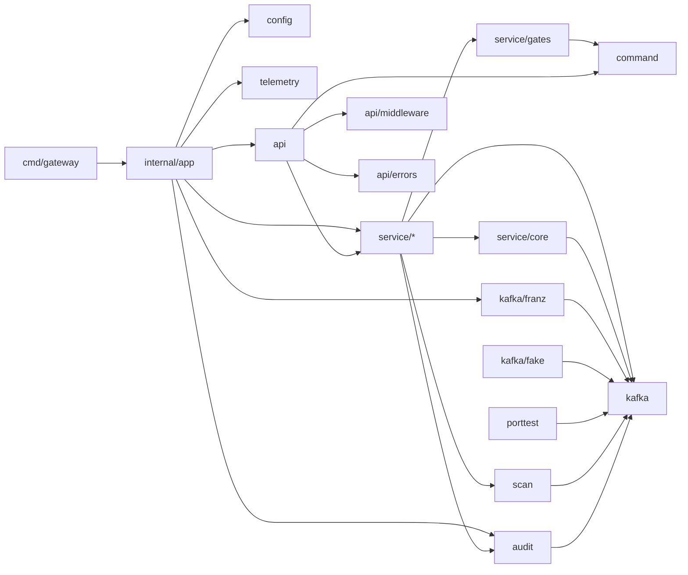

# Technical Specification

**Product:** Kafka Application Gateway
**Version:** revision 0.7
**Pipeline steps completed:** 3 (`skill-tech-stack-selector`) · 4 (`skill-tech-pattern-architect`) · 5 (`skill-tech-solid-enforcer`) · 6 (`skill-tech-test-architect`) · 7 (`skill-tech-topology-mapper`) · 8 (`skill-spec-auditor`) · 9 (`skill-task-creator` — diff-markup consumed into `TASKS.md`)
**Companion:** `FUNC-SPEC.md` rev 0.4 (approved, audited) · `TASKS.md` (Step 9)
**Date:** 2026-09-19

---

## 1. Technology Stack

### 1.0 Classification & Governing Policy

| Item | Value |
|---|---|
| Project type | **Open-source (Apache-2.0)**, governed by the **internal-project ruleset** |
| CVE policy | **Zero unpatched critical/high** vulnerabilities in the dependency tree or container image. Medium/low tracked with a fix-by date. Enforced in CI by `govulncheck` and a container scan that fails on critical/high. |
| Licence policy | Permissive only in the dependency tree: Apache-2.0 / MIT / BSD / ISC / MPL-2.0. No GPL, LGPL, AGPL, or SSPL. Enforced by a licence scan in CI. Build-time tools are exempt (not linked into the binary). |
| Supply chain | SBOM (CycloneDX + SPDX) per release · signed, reproducible, distroless images · secrets never in configuration files |
| Tech radar | **OpenTelemetry is mandatory** for traces, metrics, and logs |
| Primary driver | **Performance is essential** — compiled runtime, no CGO, low GC pressure, linear-time regex, streaming JSON |
| Database | **None** — mandated by FUNC-SPEC §6 #18 (stateless gateway) |
| Deployment target | **Containers on Kubernetes** |

### 1.1 Selected Stack (versions verified 2026-09-19)

| Layer | Choice | Pinned version | Licence | Rationale |
|---|---|---|---|---|
| Language / runtime | **Go** | **1.27.1** — toolchain pinned in `go.mod`; `CGO_ENABLED=0`; `-trimpath` | BSD-3 | Go has no LTS label; the support policy is that the two newest majors (1.27, 1.26) receive monthly security patches. 1.27.1 (2026-09-01) is the current patch. `encoding/json/v2` is stable in 1.27 with significantly faster unmarshal on the scan hot path. |
| Kafka client | **franz-go** — `kgo` (produce/consume), `kadm` (admin), `kmsg` (raw protocol) | **v1.21.7** / kadm **v1.18.0** | BSD-3 | Pure Go, no CGO, fastest Go client. `kadm` covers **every** admin call in the catalog: log directories (T3/C8), partition reassignment and cancel (C7/C9), `ElectLeaders` (C9), client quotas (S2), SCRAM credentials (S1), `LeaveGroup` (G6). C6 KRaft quorum is issued as a raw `kmsg.DescribeQuorumRequest`. Broker compatibility 0.8 → 4.4+. SASL PLAIN / SCRAM-SHA-256 / SCRAM-SHA-512 / OAUTHBEARER; TLS via `crypto/tls`. **Upgrade path:** v1.22.0 / kadm v1.19.0 (2026-09-18) adopted after a soak period via Renovate. |
| HTTP router | `net/http` standard library (pattern mux, Go ≥ 1.22) | Go 1.27 | BSD-3 | No third-party router; the standard library is the fastest path and carries no dependency risk. |
| API framework / OpenAPI | **Huma v2** | **v2.39.1** (requires Go ≥ 1.25) | MIT | Generates **OpenAPI 3.1 from code**, so the route ↔ document bijection (FUNC-SPEC O1) holds by construction. Request validation from struct tags; `x-command-id` via operation extensions; custom error model carries the FUNC-SPEC §8.3 envelope. |
| JSON | `encoding/json` (v2-backed) + `encoding/json/jsontext` streaming | Go 1.27 | BSD-3 | Scan envelopes are streamed record-by-record. No third-party JSON library, no assembly/JIT dependency. |
| Regex (M3) | `regexp` standard library | Go 1.27 | BSD-3 | **RE2 semantics — guaranteed linear time.** Catastrophic backtracking is impossible by construction. The FUNC-SPEC §8.8 per-message timeout is retained as defence-in-depth. |
| JSONPath (M4) | **theory/jsonpath** (RFC 9535) | **v0.12.1** | MIT | Standard JSONPath syntax, documented in OpenAPI. Pre-1.0: isolated behind the `scan.Matcher` func type (§2.3, I4 — Step 8 H3) so it can be swapped without touching handlers. Fallback candidate: `ohler55/ojg` (MIT). |
| Configuration | **koanf v2** | **v2.3.6** | MIT | YAML file + environment-variable overrides (environment wins). Secrets accepted **only** from environment variables or mounted files; redacted from every log line. |
| Telemetry | **OpenTelemetry Go** SDK · `otelhttp` (contrib) · franz-go `plugin/kotel` | **v1.46.0** (floor ≥ v1.44.0); logs via `otelslog` bridge until the logs SDK is stable in v1.47 | Apache-2.0 / BSD-3 | Traces and metrics for every HTTP request and every Kafka call; OTLP gRPC/HTTP exporters. |
| Logging | `log/slog` JSON to stdout; audit log = dedicated `slog` logger + optional `kgo` producer sink to a configured topic | Go 1.27 | BSD-3 | Structured, correlation id on every line (FUNC-SPEC X4); two-phase audit per FUNC-SPEC §8.5. |
| Security primitives | `crypto/subtle` constant-time API-key comparison · `crypto/sha256` plan tokens · TLS ≥ 1.2, 1.3 preferred | Go 1.27 | BSD-3 | |
| Testing | `testing` + `go-cmp`; in-memory **fake Kafka Port**; `-race` in CI | go-cmp BSD-3 | | Fakes-only per FUNC-SPEC V1 — no Testcontainers, no live cluster in the automated suite. |
| Lint / vulnerability | `golangci-lint`, `staticcheck`, `govulncheck` | latest | GPL-3 (tool) / MIT / BSD-3 | Build-time only; never linked. |
| Release / supply chain | `goreleaser` · `syft` (SBOM) · `cosign` keyless signing · GitHub Actions SLSA provenance · `grype` or `trivy` scan gate · Renovate | latest | MIT / Apache-2.0 | Reproducible builds, signed digests, automated patch PRs. |
| Container | `gcr.io/distroless/static-debian12:nonroot`, digest-pinned, multi-stage build | | Apache-2.0 | Static binary, no shell, non-root, minimal CVE surface. Alternative: Chainguard `static`. |
| Orchestration | **Kubernetes** | | | Probes → `/health/live`, `/health/ready` · `runAsNonRoot`, `readOnlyRootFilesystem`, drop ALL capabilities, seccomp `RuntimeDefault` · ConfigMap + Secret · HPA-friendly (stateless) · starting requests 100m / 128Mi, limits 1 CPU / 512Mi, tuned on load test. |

### 1.2 Rejected Alternatives

| Option | Reason |
|---|---|
| .NET 10 LTS + Confluent.Kafka | librdkafka exposes no log directories, KRaft quorum, partition reassignments, client quotas, or group-member removal → 7 catalog commands (T3, C6, C7, C8, C9-reassign, S2, G6) unimplementable without a sidecar. |
| Java 25 LTS + Quarkus / Spring Boot | Full coverage via the reference client, but higher memory floor, JIT warm-up, and a backtracking regex engine; performance-per-resource loses to Go for an I/O-bound proxy. |
| librdkafka bindings (confluent-kafka-go, Python, Rust `rdkafka`) | Same coverage gaps as .NET; requires CGO. |
| Node.js (KafkaJS / confluent-kafka-javascript) | Coverage gaps (no log dirs, quorum, quotas, SCRAM); KafkaJS maintenance status. |
| Third-party JSON (sonic, go-json) | Unnecessary after `encoding/json/v2`; sonic adds an amd64-only JIT. |
| Testcontainers / live-cluster tests | Excluded by FUNC-SPEC V1. |

### 1.3 CVE Audit Notes (2026-09-19)

| Component | Source checked | Result |
|---|---|---|
| Go 1.27.1 | go.dev release history | Current patch release; supersedes the 1.26.6 security release (2026-08-13: `crypto/tls`, `os`). **Clean.** |
| franz-go v1.21.7 / kadm v1.18.0 | OSV.dev (Go ecosystem) | **No advisories** for the module or any sub-module. |
| Huma v2.39.1 | OSV.dev | **No advisories.** |
| OpenTelemetry Go v1.46.0 | OSV.dev, Go vulnerability DB, GitHub Advisory DB | Three 2026 advisories on baggage-header parsing: **CVE-2026-29181 / GHSA-mh2q-q3fh-2475 (High, CVSS 7.5)** fixed in v1.41.0; GO-2026-5506 fixed in v1.41.0; GO-2026-5158 fixed in v1.42.0 / v1.44.0. **v1.46.0 is clean.** Version floor: ≥ v1.44.0. |
| koanf v2.3.6 | OSV.dev | **No advisories.** |
| theory/jsonpath v0.12.1 | OSV.dev | **No advisories.** Pre-1.0 is a maturity flag, not a CVE flag. |
| Distroless static image | Container scan in CI | Digest-pinned; re-scanned on every build and nightly. |

**Continuous policy:** Renovate opens a PR for every upstream patch; `govulncheck` and the image scan gate every PR; any critical/high finding blocks merge until patched or formally excepted with an expiry date.

### 1.4 Handed to Later Pipeline Steps

- **Step 4 (pattern architect):** module layout; the `KafkaPort` interface and its franz-go and fake implementations; the `scan.Matcher` func type (decided in §2.3 / I4 — Step 8 H3); the gate-pipeline middleware chain from FUNC-SPEC §9.1; error-envelope mapping into Huma's error model.
- **Step 5 (SOLID):** dependency direction — handlers → services → `KafkaPort`; no franz-go type may cross the port boundary.
- **Step 6 (test architect):** fake Kafka Port contract (FUNC-SPEC §9.7), fault-injection API, race-detector policy.
- **Step 7 (topology):** Kubernetes manifests, probe timings, resource tuning, OTLP collector wiring, audit-topic sink configuration.

## 2. Design Patterns

### 2.0 Design Decisions

| # | Decision | Value |
|---|---|---|
| P1 | Transport neutrality | Services take domain inputs plus a `Caller`, and return domain results and typed errors. Policy gates (tier, read-only mode, per-operation switches, data-plane lock, confirmation) live in the service layer so any future transport inherits them. HTTP-specific gates (request id, API-key header → `Caller`) live in the HTTP layer only. |
| P2 | Visibility | Everything under `internal/`. One binary, no public Go API. |
| P3 | Fake Kafka | Test double only. The production import graph never reaches it — enforced by lint. |

### 2.1 Macro-Architecture — Three Layers, One Composition Root

```
cmd/gateway/            entrypoint only
internal/app/           COMPOSITION ROOT: config → telemetry → adapters → services → api → http.Server
internal/config/        koanf load, validation, secret redaction; immutable Config struct
internal/command/       the command table: 41 descriptors {ID, Name, Access R|W, Destructive, DataPlane}
internal/kafka/         PORT: domain types (Topic, Partition, Record, Group, ...), typed kafka.Error,
                        and three role interfaces — Admin, Consumer, Producer. Imports stdlib only.
internal/kafka/franz/   ADAPTER: kgo + kadm + kmsg; maps kerr → kafka.Error once
internal/kafka/fake/    ADAPTER (tests only): in-memory model, call recording, fault injection
internal/scan/          one bounded scan loop; decoders; Matcher funcs (all, regex, jsonpath)
internal/audit/         Auditor; Sink interface; slog sink, kafka sink, recording sink (tests)
internal/service/       transport-neutral use cases per group (cluster, topic, message, group, security);
                        policy gates; Plan/Apply helper for destructive commands
internal/api/           Huma operations + DTOs; command table → OpenAPI x-command-id; HTTP-only gates;
                        error → FUNC-SPEC §8.4 envelope mapping
internal/telemetry/     OTel SDK wiring
```

**Dependency rule:** `api → service → kafka (port)`; `franz` and `fake` implement the port; only `internal/app` (the composition root) imports `franz`, and `cmd/gateway` imports only `internal/app` and `internal/config` (Step 7 refinement so acceptance tests can start the gateway in-process — §5.0 Y5); only `_test.go` files import `fake`. `internal/kafka` imports nothing but the standard library. Enforced by `golangci-lint` `depguard` — a violation fails the build, not a code review.

### 2.2 Patterns Adopted — Two, Both Forced by the Specs

| Pattern | Where | Problem it solves | Simpler alternative rejected |
|---|---|---|---|
| **Ports & Adapters** at exactly one boundary | `internal/kafka` (port) · `franz`, `fake` (adapters) | FUNC-SPEC V1 mandates a fakes-only suite; TECH-SPEC §1.4 forbids franz-go types above the port; the pre-1.0 JSONPath library and the deferred franz-go 1.22 upgrade must not touch handlers. Three role interfaces (Admin / Consumer / Producer — the FUNC-SPEC §8.1 protocol surfaces) rather than one 40-method interface, so each service depends only on the surface it uses. | Calling franz-go directly from services → no fake possible → V1 unsatisfiable. |
| **Sink interface** for audit | `internal/audit` | FUNC-SPEC §9.7 requires injecting a sink failure to prove fail-closed (V2); the Kafka sink is optional per configuration. The `Auditor` writes each event to a slice of sinks; an `ATTEMPT` write error from any sink aborts the mutation. | A single hard-wired slog call → the optional Kafka sink and the V2 test are both impossible. |

**Interface rule:** an interface exists only where a second implementation exists *today* (franz / fake; slog / kafka / recording). Everything else is a concrete type.

### 2.3 Conventions — Idioms, Not Patterns

| Convention | What it is | Why |
|---|---|---|
| **Declarative command table** | `command.Descriptor` per catalog ID; consumed by the API layer (OpenAPI `x-command-id`, route metadata) and by service gates (access, destructive, data-plane) | One source of truth; the O1 bijection test iterates the table; no scattered conditionals per handler |
| **Gate check as one function** | `gates.Check(caller, descriptor, cfg) error` at the top of every service method, via a small generic `run[T]` helper | The FUNC-SPEC §9.1 upper half in one place, testable as a matrix (O7, O9) |
| **Plan / Apply for destructive commands** | Each FUNC-SPEC §5.6 command has `Plan(...) (Plan, error)` and `Apply(Plan) (T, error)`; a shared higher-order helper performs confirm-vs-plan, dry-run short-circuit, `ATTEMPT` audit, apply, `RESULT` audit | Dry-run, plan tokens and two-phase audit all need the resolved plan before execution — separating the phases is free. (Template Method in OO terms; a function here.) |
| **One scan loop** | `scan.Run(ctx, consumer, spec, matcher, emit)` — M1 (`matchAll`, append), M3 (regex), M4 (jsonpath), M8 (`matchAll`, produce) | FUNC-SPEC §9.2 state machine implemented once; bounds and end-snapshot logic never duplicated |
| **Typed errors, mapped at the edges** | `kafka.Error{Kind, Resource, KafkaCode, KafkaName}` from the adapter; `service.PolicyError{Code}` from gates; the API layer owns the single Kind/Code → FUNC-SPEC §8.4 table | O5 uniformity from one table; handlers never inspect franz-go errors |
| **Constructor injection, no framework** | Dependencies passed as constructor arguments from `internal/app`; `Config` immutable after start | Go idiom; the wiring is readable in one file; restart-to-reconfigure per FUNC-SPEC §9.6 |
| **Context deadlines for bounds** | `maxTimeMs` → `context.WithTimeout`; Kafka calls honour it | Standard-library mechanism; no timer bookkeeping |
| **Client lifecycle** | One shared `kgo.Client` for admin + produce (goroutine-safe); one dedicated consumer client per scan with manual `ConsumePartitions`, closed at scan end. **No pool in v1** — measure first; the port hides the choice | Correct isolation between concurrent scans; pooling can be added later without changing the port |

### 2.4 Rejected

| Rejected | Why |
|---|---|
| CQRS / mediator / command bus | 41 handlers calling services directly is the whole dispatch layer; a bus adds indirection and nothing else |
| Repository / unit of work | No database (FUNC-SPEC §6 #18) |
| DI container / reflection-based wiring | One composition-root file; a container hides the graph |
| Strategy interface hierarchy for filters | A `Matcher` func type is the entire abstraction |
| Observer / event bus for audit | Audit is a synchronous, fail-closed write — an event bus would break fail-closed |
| Actor / worker-pool model | Request/response only; Go's per-request goroutine is the model |
| Consumer client pool | Deferred until measured; the port boundary keeps it a local change |
| Use-case interfaces per command | Violates the interface rule — no second implementation exists |
| Generic plugin / registry system | No extensibility requirement beyond the port |

### 2.5 Handed to Later Pipeline Steps

- **Step 5 (SOLID):** verify the dependency rule and the interface rule; `internal/kafka` stdlib-only; ISP on the three role interfaces.
- **Step 6 (test architect):** fake adapter contract (model, call recording, fault injection); recording audit sink; O1 table-driven bijection test; gate matrix tests.
- **Step 7 (topology):** wiring order in `internal/app` (Step 8 H4), graceful shutdown (drain scans, flush audit and OTel), probe semantics.

## 3. SOLID Constraints

The §2.2 interface rule — *an interface exists only where a second implementation exists today* — is the counterweight to every rule below. SOLID is applied to keep the two seams honest, not to add seams.

### 3.1 S — Single Responsibility

| # | Rule |
|---|---|
| S1 | **One package, one reason to change**, per §2.1: `api` changes only for HTTP/OpenAPI; `service` only for policy and use-case flow; `kafka/franz` only for client-library changes; `scan` only for scan semantics; `audit` only for audit; `config` only for configuration shape. |
| S2 | **One service type per catalog group** (`ClusterService`, `TopicService`, `MessageService`, `GroupService`, `SecurityService`); **one method per catalog command**. No method serves two command IDs. |
| S3 | **Handlers do three things only:** decode the DTO → call one service method → encode the result or error. No gate logic, no Kafka call, no business rule in `internal/api`. |
| S4 | **Adapters only translate:** `franz` maps domain ↔ franz-go types and `kerr` → `kafka.Error`. No policy, no bounds, no audit, no retries-with-semantics in an adapter. |
| S5 | **Each cross-cutting concern has exactly one home:** gates → `gates.Check`; audit → `Auditor`; scanning → `scan.Run`; error mapping → one table in `api`. A second implementation of any of these is a defect. |
| S6 | **Size guards** (lint, not review): `funlen` 60 lines / 40 statements, `gocyclo` 15, files ≤ 400 lines. |

*Example:* `TopicService.DeleteTopic` orchestrates plan → confirm → audit → `admin.DeleteTopics` and returns a domain result; the HTTP 200 and the `{ deleted }` envelope are decided in `api`, never in the service.

### 3.2 O — Open/Closed

| # | Rule |
|---|---|
| O1 | **Gates key off `command.Descriptor` fields, never off command IDs.** A `switch` on a command ID inside `gates`, `audit`, `scan`, or the error mapper is forbidden. |
| O2 | **Adding a command touches exactly three places:** one `command.Table` entry, one service method (a `Plan`/`Apply` pair if destructive), one `huma.Register` call. `gates.Check`, `Auditor`, `scan.Run`, and `MapError` are closed to modification for that change. |
| O3 | **New filters are new `scan.Matcher` funcs; new sinks implement `audit.Sink`.** `scan.Run` and `Auditor` are never edited to support one. |
| O4 | **Error mapping is table-driven** (`map[kafka.Kind]httpMapping`, `map[service.PolicyCode]httpMapping`) with a unit test that iterates every enum value and fails on a missing row. |
| O5 | **Extension is verified, not reviewed:** the O1 bijection test asserts every `command.Table` entry has exactly one Huma operation carrying its `x-command-id`, and vice-versa. |

*Example:* adding a hypothetical T13 means `command.Table = append(..., {ID: "T13", Access: W, Destructive: true})`, one `PlanT13`/`ApplyT13` pair on `TopicService`, and one `huma.Register` — with zero diff in `gates`, `audit`, or `api/errors.go`.

### 3.3 L — Liskov Substitution

| # | Rule |
|---|---|
| L1 | **One contract test suite for the port, run against both adapters:** `porttest.Run(t, port)` executes in CI against `fake`; the same function runs against `franz` under `//go:build integration` in the Level 2 manual acceptance — never in the automated suite (FUNC-SPEC V1). |
| L2 | **Identical error semantics:** both adapters return `*kafka.Error` with the same `Kind` for the same condition (unknown topic → `KindNotFound`, live group → `KindGroupActive`, deadline → `KindTimeout`). No adapter returns a foreign error type across the port. |
| L3 | **Identical context semantics:** every port method honours `ctx` cancellation and deadline; on expiry both adapters return `Kind == KindTimeout`. |
| L4 | **No hidden preconditions, no panics:** an adapter may not require setup the interface doesn't document (the fake may not demand pre-seeded topics where franz would return `KindNotFound`), and may not panic on any input the interface permits. |
| L5 | **Sinks are substitutable under fail-closed:** every `audit.Sink.Write` is concurrency-safe, bounded by `ctx`, and returns an error rather than blocking — so `Auditor` behaves identically whether the failing sink is slog, Kafka, or the recording double. |

*Example:* `porttest.Run(t, fake.New())` and `porttest.Run(t, franz.New(cfg))` both pass the case `DescribeTopic(ctx, "missing")` → `errors.As(err, &ke) && ke.Kind == kafka.KindNotFound`.

### 3.4 I — Interface Segregation

| # | Rule |
|---|---|
| I1 | **The port is three role interfaces** — `kafka.Admin`, `kafka.Consumer`, `kafka.Producer` — mirroring the FUNC-SPEC §8.1 protocol surfaces. No combined `KafkaClient` interface exists. |
| I2 | **Constructors accept exactly the roles they call:** `MessageService(Consumer, Producer)`, `TopicService(Admin, Consumer)` (offsets), `GroupService(Admin)`, `ClusterService(Admin, Consumer)` (C10 sample), `SecurityService(Admin)`. A service holding a role it never calls is a defect. The lists are illustrative; the rule governs. T4 and C10 use admin `ListOffsets`, so `topic` and `cluster` services likely need `Admin` only (Step 8 H5). |
| I3 | **`audit.Sink` has one method:** `Write(ctx, Event) error`. Lifecycle (`Close`) belongs to the concrete types, owned by the composition root. |
| I4 | **`scan.Matcher` is a func type, not an interface:** `func(Record) MatchResult`. |
| I5 | **DTOs and domain types are separate:** Huma request/response structs live in `api` with JSON tags; `kafka` domain types carry no JSON, HTTP, or validation tags. Handlers map between them. |

*Example:* `NewMessageService(c kafka.Consumer, p kafka.Producer, a *audit.Auditor)` cannot call `DeleteTopics` — it was never handed `kafka.Admin`, and that is a compile-time fact.

### 3.5 D — Dependency Inversion

| # | Rule |
|---|---|
| D1 | **`service` depends on `internal/kafka` (the port), never on `franz`, `kgo`, `kadm`, or `kmsg`. `internal/kafka` imports the standard library only.** Enforced by `depguard` — a violation fails the build. |
| D2 | **`internal/app` is the only composition root** (`cmd/gateway` is a thin entrypoint — Step 7, §5.0 Y5): the only package that constructs `franz`, sinks, services, and the Huma API. No package-level singletons, no `init()` side effects (`gochecknoglobals`, `gochecknoinits`). |
| D3 | **Types flow inward only:** adapters import port types; `api` imports `service` types; the reverse imports are forbidden by `depguard`. |
| D4 | **DIP ≠ interface everything.** Per §2.2 only the port and `Sink` are interfaces. `*audit.Auditor`, `*scan.Runner`, and services are injected as concrete pointers and are tested through the fake port and recording sink beneath them. "Accept interfaces, return structs" applies. |
| D5 | **Third-party containment** (`depguard` allow-lists): `huma` only in `api`; `koanf` only in `config`; `theory/jsonpath` and `regexp` only in `scan`; `otel` in `telemetry` plus the two instrumentation hooks (`otelhttp` in `api`, `kotel` in `franz`); franz-go only in `franz`. |

*Example:* `service.NewTopicService(admin kafka.Admin, auditor *audit.Auditor, policy service.Policy)` compiles with zero third-party imports, while `internal/app/run.go` is the only non-adapter file that imports `internal/kafka/franz`.

### 3.6 Enforcement Matrix

| Mechanism | Rules enforced |
|---|---|
| `golangci-lint` `depguard` | D1, D3, D5 |
| `gochecknoglobals`, `gochecknoinits` | D2 |
| `funlen`, `gocyclo`, file-length check | S6 |
| `exhaustive` on `Kind` / `PolicyCode` switches + enum-iteration unit test | O4 |
| O1 bijection test over `command.Table` | O2, O5 |
| `porttest.Run` contract suite (fake in CI; franz under `integration` tag) | L1–L4 |
| `Auditor` fail-closed tests with each sink type | L5 |
| Code-review checklist (the only rules not machine-checked) | S1–S5, I2, I5 |

### 3.7 Handed to Later Pipeline Steps

- **Step 6 (test architect):** `porttest` suite design; recording sink; enum-exhaustiveness and bijection tests as first-class deliverables.
- **Step 7 (topology):** `golangci-lint` configuration with the exact `depguard` rules; CI stages (lint → unit → govulncheck → build → scan).

## 4. Testing Strategy

### 4.0 Testing Decisions

| # | Decision | Value |
|---|---|---|
| T1 | Coverage gate | **90 % line overall**, measured on `service`, `scan`, `audit`, `api`, `config`, `command`, `kafka`, `kafka/fake`. **100 %** on `service/gates` and the error tables in `api`. Excluded from the CI number: `kafka/franz` (executable only against Kafka — covered by the `integration` contract suite) and `internal/app` and `cmd/gateway` (wiring — covered by acceptance; Step 7, §5.0 Y5). `-covermode=atomic`. |
| T2 | Level 2 acceptance | **Executable** HTTP e2e tests under `//go:build acceptance`, one per catalog command, run by a human against a dedicated non-production cluster; a **Markdown checklist is generated** from the `go test -json` output for the release record. |
| T3 | Performance | `testing.B` benchmarks on the hot paths, results published per PR via `benchstat`; **no CI gate**. Load testing is not mandated for v1 — revisit once a baseline exists. |
| T4 | Fuzzing & security | Go native fuzzing on every parser of untrusted bytes; short run per PR, long run nightly. `gosec` added to `golangci-lint`. |

### 4.1 Test Levels

| Level | What | Doubles | Runs |
|---|---|---|---|
| 0 Static | `golangci-lint` (incl. `gosec`, `depguard`, `exhaustive`, `funlen`, `gocyclo`), `govulncheck`, licence scan | — | every PR |
| 1a Unit | Pure logic: `scan` matchers and decoders, plan token, `gates.Check` matrix, error tables, config validation, command table | none | every PR |
| 1b Component (HTTP) | `httptest` server running the **real Huma router and real services** over the fake port and recording sink — the bulk of behavioural tests: every FUNC-SPEC §9.1 branch, every §8.4 code, every envelope, OpenAPI golden | fake port, recording sink, injected `now` | every PR |
| 1c Contract | `porttest.Run(t, fake.New())` | — | every PR |
| 1d Fuzz | `testing.F` targets (§4.6) | none | 10 s per target per PR; 10 min per target nightly |
| 1e Benchmarks | `testing.B` (§4.7) | fake port | every PR, published |
| 2 Acceptance | `//go:build acceptance` HTTP e2e + `//go:build integration` `porttest.Run(t, franz.New(cfg))` against a live cluster | none | human-triggered per release |

**Ratio guidance:** ~60 % of cases at 1b, ~30 % at 1a, ~10 % at 1c/1d. Behaviour lives at gates and envelopes, so the HTTP component level is where correctness is proven; the fake port is the unit of mockability.

### 4.2 Frameworks & Tools

| Purpose | Tool | Licence | Version policy |
|---|---|---|---|
| Runner, assertions, fuzz, bench | `testing`, `testing.F`, `testing.B` (Go 1.27 stdlib) | BSD-3 | with toolchain |
| Structural diff | `github.com/google/go-cmp` | BSD-3 | pinned at implementation; Renovate |
| HTTP component | `net/http/httptest` | BSD-3 | stdlib |
| Port contract | `internal/kafka/porttest` (own package) | project | — |
| Telemetry assertions | `go.opentelemetry.io/otel/sdk/trace/tracetest` in-memory exporter | Apache-2.0 | with OTel v1.46.0 |
| Benchmark comparison | `golang.org/x/perf/cmd/benchstat` | BSD-3 | pinned at implementation |
| Coverage gate | `go test -coverprofile` + a per-package threshold check (script or `go-test-coverage` action, MIT) | BSD-3 / MIT | pinned at implementation |
| Security lint | `gosec` via `golangci-lint` | Apache-2.0 | with golangci-lint |
| Checklist generator | `tools/acceptance-report` (own, reads `go test -json`) | project | — |

No third-party mocking framework: the fake port and the recording sink are hand-written doubles with a specified contract (§4.3–§4.4). No Testcontainers (FUNC-SPEC V1).

### 4.3 Fake Kafka Port — Contract

Location `internal/kafka/fake`; imported only from `_test.go` files (`depguard`). Implements `kafka.Admin`, `kafka.Consumer`, `kafka.Producer`; concurrency-safe (`-race` clean).

| Aspect | Requirement |
|---|---|
| Model | Brokers (id, host, port, rack, configs with source, log dirs with sizes) · topics (partitions with leader/replicas/ISR, per-partition record log with offset/timestamp/key/value/headers, begin offset, configs with source, internal flag) · consumer groups (state, members, committed offsets) · SCRAM users (no secrets stored) · client quotas · reassignments in progress · KRaft quorum |
| Semantics | Offsets monotonic per partition; `DeleteRecords` raises the begin offset; produce appends with the caller's timestamp or `now()`; `ListOffsets` by timestamp; describe on a missing resource → `KindNotFound`; group with members → `KindGroupActive` on reset/delete. Compaction is **not** simulated (documented). |
| Recording | Every call appended to `Calls()`; helpers `AssertNoCommits(t)`, `AssertNoGroupJoin(t)`, `AssertCalled(t, method)`, `MutatingCalls()` |
| Fault injection | `FailNext(method, kind)`, `FailAlways(method, kind)`, `Latency(method, d)`, `Unreachable(true)` |
| Seeding | `SeedTopic(name, partitions, records...)`, `SeedGroup(id, offsets...)`, `SeedBroker(...)` |
| Time | Accepts the same injected `now func() time.Time` as `scan.Runner`, so timestamps are deterministic |

### 4.4 Recording Audit Sink

`audit.Sink` implementation in `internal/audit/audittest`: `Events()`, `FailNext(phase)`, `FailAlways()`. Used for O8, V2, V6 and rejection-audit assertions.

### 4.5 Traceability — FUNC-SPEC → Tests

| FUNC-SPEC | Level | Location | Key cases |
|---|---|---|---|
| O1 OpenAPI bijection | 1a | `api` | iterate `command.Table` ↔ operations with `x-command-id`; golden `testdata/openapi.golden.json` |
| O3 bounds | 1b | `api/messages` | limit > ceiling → 400 `BOUND_EXCEEDED`; seeded > limit → `stoppedBy=maxMessages` + continuation; oversized → `maxBytes`; `Latency` + injected `now` → `maxTime` |
| O4 reads don't mutate | 1b | every `R` route | `AssertNoCommits`, `AssertNoGroupJoin` after each |
| O5 error taxonomy | 1a + 1b | `api/errors` | enum-iteration table test; `FailNext(kind)` per Kind → §8.4 row; `requestId` present |
| O6 health | 1b | `api/health` | `Unreachable(true)` → `/ready` 503, `/live` 200 |
| O7 tiers | 1b | matrix over `command.Table` | every `W` × reader → 403 `TIER_FORBIDDEN`; every route × no key → 401; auth off → all pass |
| O8 destructive | 1b | every §5.6 route | no/wrong `confirm` → 400; `dryRun` → zero `MutatingCalls()` + `plan`; execute → `ATTEMPT` then `RESULT`; stale plan token → 400 |
| O9 switches & lock | 1b | matrix | F2 → all `W` 403; F3 one op → only that op 403; F6 → M1–M8 403; operator + header → 200 + `HIGH`; reader + header → 403 + `HIGH` |
| V2 fail-closed | 1b | destructive routes | `audittest.FailNext(ATTEMPT)` → 503 `AUDIT_UNAVAILABLE`, zero `MutatingCalls()` |
| V3 bulk | 1b | T6, T8, M5, M6, C12 | one invalid → 400 + zero executions; one `FailNext` during execute → 207 per-item |
| V6 HIGH severity | 1b | T7, T8, T11, T12, G5 | `RESULT.severity == HIGH`; other `W` → `INFO` |
| §9.1 flowchart | 1b | — | every exit node (401, 403 ×4, 400 ×2, 503, 502, 200) has a named test; every `RESULT`/`REJECTED` audit branch asserted |
| §9.2 scan states | 1a + 1b | `scan` | Empty · Exhausted · Bounded (each bound) · end snapshot (records appended mid-scan not returned) · continuation gap- and overlap-free · `latest` ordering |
| §9.3 replay | 1b | M8 | `preservePartition` mismatch → 400; `FailNext(Produce)` mid-batch → 502 with `progress`; headers/timestamps byte-equal |
| §9.4 bulk | 1b | as V3 | plus `BULK_VALIDATION_FAILED` details-list completeness |
| §9.5 lock | 1b | M1–M8 | as O9; `dryRun=true` still locked |
| Decoding | 1a | `scan` | JSON → `json`; UTF-8 → `string`; invalid → `base64`; `format=` override; header-value rule |
| Regex / JSONPath | 1a | `scan` | invalid → 400; nested-quantifier pattern completes in linear time (RE2 — assert a time bound, not a timeout); each `op` positive/negative; missing path; type mismatch |
| Pagination | 1b | T1, G1 | stable order; page past end → empty `items`, correct `total` |
| X4 request id | 1b | any route | echo supplied id; generate otherwise; present on errors |
| X5 CORS | 1b | preflight | configured origin allowed, other refused |
| L1–L4 port contract | 1c / 2 | `porttest` | same suite, fake in CI, franz under `integration` |
| Telemetry | 1b | `tracetest` | one server span per request; child span per Kafka call; `requestId` attribute |

### 4.6 Fuzz Targets

`scan.Decode` (value/key auto-detect) · header value encoding · `from=` / `to=` parameter parser · NDJSON body parser (M6) · plan-token canonicalisation (deterministic under reordering, stable across runs) · API-key header parser · JSONPath `path` compile (must return an error, never panic). Corpus seeds committed under `testdata/fuzz/`.

### 4.7 Benchmarks (Published, No Gate — T3)

`BenchmarkScanRun/{1k,10k}records` · `BenchmarkDecode/{json,string,binary}` · `BenchmarkRegexMatch` · `BenchmarkJSONPathEval` · `BenchmarkEncodeScanEnvelope` · `BenchmarkGatesCheck` · `BenchmarkPlanToken`. Each reports `ns/op`, `B/op`, `allocs/op`; `benchstat` output is attached to the PR as an artifact. Recommendation recorded: introduce a regression threshold after three stable baselines.

### 4.8 Level 2 Acceptance — Executable + Generated Checklist (T2)

- **Location:** `test/acceptance/`, `//go:build acceptance`. Starts the gateway **in-process** (reusing `internal/app`'s `app.Run(ctx, cfg)` — Step 7, §5.0 Y5) with the franz adapter against `KAFKA_BOOTSTRAP` (plus TLS/SASL environment), then drives HTTP.
- **One test per catalog command**, named `TestAcceptance_<ID>_<Name>` (41 tests); each asserts the HTTP response **and** the cluster effect through the port (for example, the topic is really gone).
- **Isolation:** all created resources are prefixed `acc-<runID>-`; destructive tests touch only prefixed resources; `t.Cleanup` deletes them.
- **Cluster prerequisites:** dedicated non-production cluster; operator key; all per-operation switches enabled; read-only mode and data-plane lock off; audit sink to stdout.
- **Also in the run:** `porttest.Run(t, franz.New(cfg))` under `//go:build integration`.
- **Report:** `go test -json -tags acceptance,integration ./test/... | go run ./tools/acceptance-report` → `docs/acceptance/<gateway-version>-<date>.md` with one row per command: ID, name, result, duration, broker version, run id. Committed with the release.

### 4.9 Conventions

Table-driven tests; `t.Parallel()` by default (each test owns its fake); **no `time.Sleep`** — time via injected `now`, waiting via channels and `context`; golden files updated only with `-update`; test names `Test<Unit>_<Case>`; fixtures in `testdata/`; one small helper package `internal/testutil` exposing `NewTestGateway(t, opts...)` (httptest server + fake + recording sink + fixed clock) — the only shared test scaffolding.

### 4.10 CI Stages (Testing View — Step 7 Owns the Pipeline)

PR: lint → `go test -race -covermode=atomic ./...` + coverage gate (T1) → fuzz 10 s per target → `govulncheck` → build → benchmarks published. Nightly: fuzz 10 min per target; benchmark trend. Acceptance: manual workflow dispatch with cluster credentials.

### 4.11 Handed to Later Pipeline Steps

- **Step 7 (topology):** `golangci-lint` configuration, coverage-gate implementation, workflow definitions, acceptance workflow with secrets.
- **Step 9 (task creator):** the fake port, `porttest`, `audittest`, and `testutil` are **Phase 1 deliverables** — nothing else is testable before they exist.
- **Step 10 (task verifier):** attaches the concrete cases from §4.5 to each task.

## 5. System Topology & File Structure

### 5.0 Topology Decisions

| # | Decision | Value |
|---|---|---|
| Y1 | Repository | Single repository, single Go module `github.com/misterkafkagod/kafka3o`; source, tests, Dockerfile, Helm chart, CI, and the spec files together |
| Y2 | Layout style | **Layer-driven at the top** (`internal/<layer>`), **feature-driven inside** the two wide layers: `internal/service/<group>` and `internal/api/<group>` for the five catalog groups |
| Y3 | Deployment packaging | Helm chart `deploy/helm/kafka3o-gateway`, published as an OCI artifact with the image |
| Y4 | Artifact names | Binary `kafka3o-gateway` (from `cmd/gateway`), image `ghcr.io/misterkafkagod/kafka3o-gateway`, chart `kafka3o-gateway` |
| Y5 | Composition root | `internal/app` (`app.Run(ctx, cfg)`); `cmd/gateway/main.go` is a thin entrypoint. Refines §2.1 and D2 so the acceptance suite (§4.8) can start the gateway in-process. |

Naming under Y2: §3 S2's `TopicService`, `MessageService`, … are realised as `topic.Service`, `message.Service`, … — the Go idiom for sub-packages; the rule is unchanged.

### 5.1 Directory Tree

```text
kafka3o/
├── go.mod · go.sum                       module github.com/misterkafkagod/kafka3o · go 1.27 · toolchain go1.27.1
├── Makefile                              lint · test · cover · fuzz · bench · build · image · openapi · acceptance · report
├── Dockerfile                            golang:1.27.1 builder → distroless/static-debian12:nonroot (digest-pinned)
├── .goreleaser.yaml                      binary, SBOM (syft), cosign, image, SLSA provenance, Helm OCI push
├── .golangci.yml                         depguard rules (§5.3), gosec, exhaustive, funlen, gocyclo, gochecknoglobals, gochecknoinits, ireturn
├── renovate.json
├── LICENSE (Apache-2.0) · README.md · SECURITY.md · CONTRIBUTING.md · CHANGELOG.md
├── FUNC-SPEC.md · TECH-SPEC.md · TASKS.md  pipeline artefacts
├── .github/
│   ├── CODEOWNERS
│   └── workflows/
│       ├── ci.yml                        lint → test (-race, coverage gate) → fuzz 10 s → govulncheck → build → bench publish
│       ├── nightly.yml                   fuzz 10 min · bench trend · image re-scan
│       ├── release.yml                   goreleaser on tag
│       └── acceptance.yml                workflow_dispatch · secrets KAFKA_* · -tags acceptance,integration · commits report
├── cmd/gateway/main.go                   entrypoint: load config → app.Run
├── internal/
│   ├── app/                              COMPOSITION ROOT: run.go (wires config → telemetry → franz → services → api → http.Server; graceful shutdown)
│   ├── config/                           config.go · load.go (koanf: YAML + KGW_ env) · validate.go · redact.go · *_test.go · testdata/
│   ├── command/                          table.go (41 descriptors) · table_test.go
│   ├── kafka/                            PORT: port.go (Admin, Consumer, Producer) · types.go · errors.go (Error, Kind) — stdlib only
│   │   ├── franz/                        client.go · admin.go · consumer.go · producer.go · errors.go (kerr→Kind) · quorum.go (kmsg) · security.go (TLS/SASL) · franz_integration_test.go  //go:build integration
│   │   ├── fake/                         fake.go · model.go · admin.go · consumer.go · producer.go · faults.go · seed.go · fake_test.go (runs porttest)
│   │   └── porttest/                     suite.go · admin.go · consumer.go · producer.go
│   ├── scan/                             runner.go (Run, Spec, Stats) · decode.go · matcher.go · regex.go · jsonpath.go · *_test.go · fuzz_test.go · bench_test.go · testdata/fuzz/
│   ├── audit/                            auditor.go · event.go · sink.go · sink_slog.go · sink_kafka.go · *_test.go
│   │   └── audittest/                    recording.go
│   ├── service/
│   │   ├── core/                         caller.go · policy.go · run.go (run[T]) · destructive.go (Plan/Apply helper) · bulk.go · plantoken.go · errors.go (PolicyError, Code) · *_test.go
│   │   ├── gates/                        check.go · check_test.go                     ← 100 % coverage
│   │   ├── cluster/                      service.go (C1–C4, C6–C8, C10, C11) · destructive.go (C5, C9, C12) · *_test.go
│   │   ├── topic/                        service.go (T1–T6) · destructive.go (T7–T12) · *_test.go
│   │   ├── message/                      service.go (M1–M7) · replay.go (M8) · *_test.go
│   │   ├── group/                        service.go (G1–G3) · destructive.go (G4–G7) · *_test.go
│   │   └── security/                     service.go (S1, S2) · *_test.go
│   ├── api/
│   │   ├── api.go                        New(deps) http.Handler: Huma config, middleware chain, mounts groups, /openapi.json
│   │   ├── openapi_test.go               O1 bijection + golden
│   │   ├── testdata/openapi.golden.json
│   │   ├── middleware/                   requestid.go · apikey.go (→ core.Caller) · cors.go · *_test.go
│   │   ├── errors/                       tables.go (Kind→HTTP, Code→HTTP) · envelope.go · tables_test.go  ← 100 % coverage
│   │   ├── health/                       live.go · ready.go · *_test.go
│   │   └── cluster/ topic/ message/ group/ security/
│   │                                     routes.go (huma.Register ×N) · dto.go · mapping.go · *_test.go (component tests via testutil)
│   ├── telemetry/                        otel.go (providers, OTLP exporters, shutdown) · slog.go (otelslog bridge)
│   └── testutil/                         gateway.go (NewTestGateway) · clock.go · http.go
├── test/acceptance/                      //go:build acceptance · main_test.go (TestMain → app.Run against KAFKA_BOOTSTRAP) · cluster_test.go · topic_test.go · message_test.go · group_test.go · security_test.go · helpers.go
├── tools/acceptance-report/main.go       go test -json → docs/acceptance/<version>-<date>.md
├── deploy/helm/kafka3o-gateway/          Chart.yaml · values.yaml · values.schema.json · README.md
│   └── templates/                        deployment · service · serviceaccount · configmap · secret · networkpolicy · pdb · hpa · tests/
├── configs/config.example.yaml           every key, every default, secrets shown as env references
└── docs/
    ├── api/openapi.json                  exported from the golden by `make openapi`
    ├── acceptance/                       generated release reports
    └── operations.md                     configuration reference, probes, shutdown, audit sink, break-glass procedure
```

### 5.2 Component Relationships (arrows = allowed imports)



### 5.3 Dependency Boundaries (`depguard` rules — build-failing)

| Package | May import (beyond stdlib) | Forbidden |
|---|---|---|
| `internal/kafka` | **nothing** | any `internal/*`, any third-party |
| `internal/kafka/franz` | `kafka`, `telemetry` (kotel hook), `github.com/twmb/franz-go/**` | `service`, `api`, `fake` |
| `internal/kafka/fake` | `kafka` | third-party; imported **only** from `_test.go` |
| `internal/kafka/porttest` | `kafka`, `go-cmp` | `franz`, `fake` |
| `internal/scan` | `kafka`, `regexp`, `theory/jsonpath`, `encoding/json/v2` | `service`, `api`, franz-go |
| `internal/audit` | `kafka` (Producer for the sink), `log/slog` | `service`, `api`, franz-go |
| `internal/service/**` | `kafka`, `command`, `scan`, `audit`, `service/core`, `service/gates` | `api`, `franz`, `fake`, any HTTP or Huma import |
| `internal/api/**` | `service/**`, `command`, `api/*`, `huma`, `otelhttp` | `kafka/franz`, `fake`, `scan`, franz-go |
| `internal/app` | everything internal, `franz` | `fake`, `porttest`, `audittest`, `testutil` |
| `cmd/gateway` | `app`, `config` | everything else |
| `internal/testutil`, `audittest` | `fake`, `api`, `service/**`, `audit` | imported **only** from `_test.go` |
| `test/acceptance` | `app`, `config`, `kafka`, `franz` (effect assertions) | `fake` |

### 5.4 Runtime Topology (Kubernetes, via the Helm Chart)

| Object | Definition |
|---|---|
| `Deployment` | stateless; `replicas: 2` default; `securityContext`: `runAsNonRoot`, `readOnlyRootFilesystem`, `allowPrivilegeEscalation: false`, drop ALL, seccomp `RuntimeDefault`; resources per §1.1; `terminationGracePeriodSeconds: 30`; `preStop` sleep 5 s |
| Probes | `exec` probes running the binary itself — `kafka3o-gateway probe --live` / `--ready` — which call `http://127.0.0.1:8080/health/*` with the reader-tier key from `KGW_PROBE_API_KEY` and exit 0/1 (no endpoint is unauthenticated — Step 8 B3); single container port **8080** |
| `Service` | ClusterIP 8080 |
| `ConfigMap` | `/etc/kafka3o/config.yaml` — non-secret configuration (bounds, switches, lock, CORS, audit sink, OTLP endpoint, trusted proxies, timeouts) |
| `Secret` | env `KGW_API_KEYS` (JSON list of `{ id, tier, sha256 }` — Step 8 B4), `KGW_PROBE_API_KEY` (raw reader key for probes), `KGW_KAFKA_SASL_USERNAME` / `KGW_KAFKA_SASL_PASSWORD`; TLS material mounted at `/etc/kafka3o/tls/` |
| `NetworkPolicy` | egress only to the broker CIDR/ports and the OTLP collector; ingress only from the UI/consumer namespace |
| `PodDisruptionBudget` | `minAvailable: 1` |
| `HorizontalPodAutoscaler` | optional, CPU-based; safe because the gateway is stateless |
| `ServiceAccount` | no token automount |
| Environment | prefix `KGW_`; environment overrides YAML; restart to reconfigure (FUNC-SPEC §9.6) |
| Shutdown order | SIGTERM → stop accepting → drain in-flight (≤ `maxTime` + 5 s) → flush audit sinks → OTel shutdown → close `kgo` clients |

### 5.5 Validation — Tests Align with Implementation Paths

| Test artefact (§4) | Path | Alignment check |
|---|---|---|
| Unit / component tests | `_test.go` beside each file | co-located; `t.Parallel()` per package |
| Fake port | `internal/kafka/fake` | sibling of `franz`; `fake_test.go` runs `porttest` |
| Contract suite | `internal/kafka/porttest` | non-test package, importable by `fake_test.go` and `franz_integration_test.go` |
| Recording sink | `internal/audit/audittest` | sibling of the sinks it doubles |
| Test scaffolding | `internal/testutil` | one package; `depguard` limits it to `_test.go` importers |
| OpenAPI golden | `internal/api/testdata/openapi.golden.json` | beside the bijection test that owns it |
| Fuzz corpora | `<pkg>/testdata/fuzz/` | Go's default corpus location |
| Benchmarks | `internal/scan/bench_test.go` | beside the hot path |
| Acceptance | `test/acceptance/` (`//go:build acceptance`) | separate tree, excluded from `./internal/...` coverage |
| Coverage-gate packages | `internal/{config,command,kafka,kafka/fake,scan,audit,service/**,api/**}` | `franz`, `app`, `cmd` excluded as decided in T1 |

### 5.6 Handed to Later Pipeline Steps

- **Step 9 (task creator):** Phase 1 = `go.mod`, `.golangci.yml`, `internal/kafka` port, `fake`, `porttest`, `audittest`, `testutil`, `command` table, CI skeleton. Phase order follows the §5.2 arrows bottom-up.
- **Step 12 (implementation writer):** module path and artifact names are final — nothing to substitute at first commit.

## 6. Spec Audit (Step 8)

**Audited:** FUNC-SPEC.md rev 0.2 → amended to rev 0.3 · TECH-SPEC.md rev 0.5 → amended to rev 0.6
**Date:** 2026-09-19

### 6.0 Verdict

**`STATUS: READY`** — with the resolutions in §6.1 written into both specs. Every requirement is deterministic, the verification strategy is defined and supported by the stack, all pinned versions are CVE-clean, and the remaining risks are explicitly accepted (§6.5).

| Cross-examination | Result |
|---|---|
| Stack supports the verification strategy | ✅ V1 fakes-only ↔ Kafka Port + `porttest`; O2 ↔ executable acceptance (T2); every FUNC-SPEC §9.1 exit and §9.2 transition has a row in §4.5 |
| Admin-API coverage of all 41 commands | ✅ kadm + `kmsg` for C6 (verified in Step 3) |
| Versions / CVEs | ✅ all pinned versions clean; OTel High CVE fixed below the floor |
| Patterns / SOLID / topology consistency | ✅ after the Step 7 composition-root refinement and the H1–H5 fixes |
| Audit, break-glass, plan-token, bulk, replay semantics | ✅ consistent across FUNC-SPEC §8.5, §8.6, §9.1, §9.3–§9.5 |
| Determinism for Steps 9–12 | ✅ after B1–B8 |

### 6.1 Blockers Found and Resolved

| # | Gap | Resolution |
|---|---|---|
| B1 | No URL / HTTP-verb table (FUNC-SPEC §7 left it to Step 3; never closed) | URL / verb table adopted — §6.2 |
| B2 | O1 / O5 "exactly one operation per ID" unsatisfiable for C3, C9, S1, S2 | Reworded: every operation carries exactly one `x-command-id`; the set of IDs across operations equals the catalog; C3, C9, S1, S2 map to 2, 3, 3, 2 sub-operations. FUNC-SPEC §9.7 O1 amended; §3.2 O5 reads accordingly. |
| B3 | Auth on `/health/*` and `/openapi.json` undefined vs. Kubernetes probes | **No endpoint is exempt.** Probes are `exec` probes running `kafka3o-gateway probe --live` / `--ready` against `127.0.0.1:8080` with a reader-tier key from `KGW_PROBE_API_KEY`. `/openapi.json` and `/docs` need a key (reader suffices). §5.4 amended. |
| B4 | API-key configuration format undefined | `KGW_API_KEYS` = JSON list of `{ id, tier, sha256 }`. Presented key → SHA-256 → `crypto/subtle` compare. `kafka3o-gateway keygen --tier <reader\|operator>` prints a 32-byte random key and its digest. Duplicate ids rejected at start-up. Raw secrets never in config. |
| B5 | Audit Kafka topic provisioning and readiness undefined under fail-closed | Never auto-created. Start-up verifies existence and writability (ERROR log otherwise). `/health/ready` stays UP and reports `audit: { sink, healthy }`; mutations return 503 `AUDIT_UNAVAILABLE` (V2) until healthy. Documented topic settings: `cleanup.policy=delete`, `retention.ms ≥ 1 year`, `min.insync.replicas=2`. |
| B6 | `clientIp` behind proxies undefined | `KGW_HTTP_TRUSTED_PROXIES` (CIDR list, default empty). When the peer is trusted, the right-most untrusted `X-Forwarded-For` entry is used; otherwise the peer address. |
| B7 | `pattern` semantics undefined (T1, T8, C11) | RE2 regex, unanchored, matched against the full topic name; invalid → 400 `INVALID_REGEX`. FUNC-SPEC §8.2 amended. |
| B8 | M3/M4 accepted both `limit` and `maxMatches`; `maxMatches` unbounded | M3/M4 reject `limit`; `maxMatches` default 100 / ceiling 1 000. FUNC-SPEC §8.7, §8.8 amended. |

### 6.2 URL / Verb Table (resolves B1)

Conventions: resource nouns; `R` commands are `GET`, except M3/M4 which `POST` a search body and remain `R`; entity deletes are `DELETE` with a JSON body; other mutations are `POST` action sub-resources or `PATCH`; multi-target commands live under `/v1/batch/` so no literal path segment can collide with a topic or group name.

| ID | Method · Path |
|---|---|
| C1 | `GET /v1/cluster` |
| C2 | `GET /v1/cluster/brokers/{brokerId}/config` |
| C3 | `GET /health/live` · `GET /health/ready` |
| C4 | `GET /v1/cluster/health` |
| C5 | `PATCH /v1/cluster/brokers/{brokerId}/config` |
| C6 | `GET /v1/cluster/quorum` |
| C7 | `GET /v1/cluster/reassignments` |
| C8 | `GET /v1/cluster/log-dirs?brokerId=` |
| C9 | `POST /v1/cluster/reassignments` · `POST /v1/cluster/reassignments/cancel` · `POST /v1/cluster/elections` |
| C10 | `GET /v1/cluster/throughput?topic=&seconds=` |
| C11 | `GET /v1/cluster/export?pattern=` |
| C12 | `POST /v1/batch/topics/apply` |
| T1 | `GET /v1/topics?pattern=&includeInternal=&page=&pageSize=` |
| T2 | `GET /v1/topics/{name}` |
| T3 | `GET /v1/topics/{name}/size` |
| T4 | `GET /v1/topics/{name}/count?from=&to=` |
| T5 | `POST /v1/topics` |
| T6 | `POST /v1/batch/topics` |
| T7 | `DELETE /v1/topics/{name}` |
| T8 | `POST /v1/batch/topics/delete` |
| T9 | `PATCH /v1/topics/{name}/config` |
| T10 | `POST /v1/topics/{name}/partitions` |
| T11 | `POST /v1/topics/{name}/delete-records` |
| T12 | `POST /v1/topics/{name}/purge` |
| M1 | `GET /v1/topics/{name}/messages` |
| M2 | `GET /v1/topics/{name}/partitions/{partition}/messages/{offset}` |
| M3 | `POST /v1/topics/{name}/messages/search` |
| M4 | `POST /v1/topics/{name}/messages/filter` |
| M5 | `POST /v1/topics/{name}/messages` |
| M6 | `POST /v1/topics/{name}/messages/bulk` |
| M7 | `POST /v1/topics/{name}/tombstones` |
| M8 | `POST /v1/replays` |
| G1 | `GET /v1/consumer-groups?state=&page=&pageSize=` |
| G2 | `GET /v1/consumer-groups/{groupId}` |
| G3 | `GET /v1/topics/{name}/consumer-groups` |
| G4 | `POST /v1/consumer-groups/{groupId}/reset-offsets` |
| G5 | `DELETE /v1/consumer-groups/{groupId}` |
| G6 | `POST /v1/consumer-groups/{groupId}/remove-members` |
| G7 | `POST /v1/consumer-groups/{target}/clone-offsets` |
| S1 | `GET /v1/scram-users` · `POST /v1/scram-users` · `DELETE /v1/scram-users/{name}` |
| S2 | `GET /v1/quotas?entityType=` · `PATCH /v1/quotas` |
| — | `GET /openapi.json` · `GET /docs` (Huma UI; `KGW_DOCS_ENABLED`, default on) |

Operation count: 48 operations carrying 41 command ids (C3 ×2, C9 ×3, S1 ×3, S2 ×2), plus the two documentation routes, which carry no command id.

### 6.3 Clarifications Adopted (C1–C14)

| # | Clarification |
|---|---|
| C1 | Break-glass bypasses **F6 only** — never F1, F2, or F3. Read-only mode blocks M5–M8 regardless of the header. |
| C2 | `X-Request-Id` echoed only if it matches `^[A-Za-z0-9._-]{1,128}$`, else regenerated. `X-Break-Glass-Reason` capped at 512 bytes, control characters stripped. |
| C3 | Supported brokers: **Apache Kafka 3.3 → 4.x**; older clusters best-effort. A feature the cluster lacks (e.g. C6 on ZooKeeper) surfaces as 502 `KAFKA_ERROR` with `kafkaError.name = UNSUPPORTED_VERSION`. |
| C4 | Producer defaults for M5–M8: `acks=all`, idempotence on (`KGW_KAFKA_PRODUCER_ACKS`). Consumer isolation for M1–M4/M8: `read_committed` (`KGW_KAFKA_ISOLATION_LEVEL`). |
| C5 | The audit Kafka sink uses a **dedicated** producer client (`acks=all`, idempotent), separate from the data-plane producer. |
| C6 | HTTP listener: plain HTTP by default (TLS at ingress/mesh); optional native TLS via `KGW_HTTP_TLS_CERT` / `KGW_HTTP_TLS_KEY`. `ReadHeaderTimeout` 10 s, `IdleTimeout` 60 s, `WriteTimeout` ≥ `maxTimeMs` ceiling + 5 s. JSON body limit 1 MB (`KGW_HTTP_BODY_LIMIT`); M6 keeps 10 MB. |
| C7 | Request and response bodies are never logged; S1 passwords never appear in audit `target`. |
| C8 | Plan token = lower-case hex SHA-256 (64 chars) of `commandId + "\n" + sorted-unique targets joined by "\n"`; for C12 each target is `name + "=" + sha256(canonical desired definition)`. |
| C9 | `to` bounds a scan as `min(to, endSnapshot)`. `from=latest`: `continuation[p]` = start offset used, `reachedEnd = true`; older pages via `from=offset:<start − limit>&to=offset:<start>`. |
| C10 | G4 `timestamp` beyond the latest record → `latest`; before the earliest → `earliest`. M2 → 404 when the first record fetched at `offset` has a greater offset. |
| C11 | C4 `affected[]` capped at 1 000 entries with `truncated: true`. S1 `iterations` default 4096. |
| C12 | Helm `values.schema.json` enforces `terminationGracePeriodSeconds ≥ ceil(maxTimeMs / 1000) + 10`; NetworkPolicy egress also allows DNS. |
| C13 | CORS preflight allows `X-Api-Key`, `X-Break-Glass-Reason`, `X-Request-Id`, `Content-Type`; exposes `X-Request-Id`; origins from `KGW_CORS_ORIGINS`; no wildcard while auth is enabled. |
| C14 | On 401 the audit `caller.keyId` is `null`; with auth disabled it is `null` and `tier = operator`. |

**Configuration keys introduced by this audit** (all restart-only, all with defaults): `KGW_API_KEYS`, `KGW_PROBE_API_KEY`, `KGW_HTTP_TRUSTED_PROXIES`, `KGW_HTTP_TLS_CERT`, `KGW_HTTP_TLS_KEY`, `KGW_HTTP_READ_HEADER_TIMEOUT`, `KGW_HTTP_IDLE_TIMEOUT`, `KGW_HTTP_BODY_LIMIT`, `KGW_AUDIT_TOPIC`, `KGW_KAFKA_PRODUCER_ACKS`, `KGW_KAFKA_ISOLATION_LEVEL`, `KGW_CORS_ORIGINS`, `KGW_DOCS_ENABLED`. Binary subcommands introduced: `probe`, `keygen`.

### 6.4 Documentation Hygiene Applied (H1–H5)

| # | Fix | Where |
|---|---|---|
| H1 | Three "still open for Step 3" items closed | FUNC-SPEC §7 |
| H2 | G7 `target` moved to the path | FUNC-SPEC §8.7 |
| H3 | "`Filter` interface" → `scan.Matcher` func type | TECH-SPEC §1.1, §1.4 |
| H4 | "wiring order in `cmd/gateway`" → `internal/app` | TECH-SPEC §2.5 |
| H5 | I2 role lists marked illustrative | TECH-SPEC §3.4 |

### 6.5 Accepted Risks

| # | Risk | Owner / trigger |
|---|---|---|
| R1 | **No concurrency cap on scans** (FUNC-SPEC §6 #8, declined). Each scan opens a consumer client; `net/http` does not bound in-flight requests. Mitigation is external: pod resource limits, HPA, ingress rate limiting. | Revisit at the first load baseline (T3). |
| R2 | `theory/jsonpath` is pre-1.0. | Behind the `Matcher` seam; swap to `ohler55/ojg` if it stalls. |
| R3 | `DELETE` requests with JSON bodies (T7, G5, S1 delete) — some intermediaries strip them. | Documented in OpenAPI and `docs/operations.md`; the `confirm` check fails closed (400) if the body is lost. |

### 6.6 Handed to Step 9

- Phase 1 must include `internal/kafka`, `fake`, `porttest`, `audittest`, `testutil`, `command`, `config` (with the §6.3 keys), and the `probe` / `keygen` subcommands' minimal surface.
- The 48 operations in §6.2 are the enumeration for the O1 bijection test and the 41 acceptance tests.

## 7. Revision Log

| Rev | Date | Step | Change |
|---|---|---|---|
| 0.1 | 2026-09-19 | 3 — stack selector | Initialized: classification and policy, selected stack with pinned versions, rejected alternatives, CVE audit notes, hand-offs. |
| 0.2 | 2026-09-19 | 4 — pattern architect | Added §2: design decisions P1–P3, macro-architecture and dependency rule, two adopted patterns with justification, conventions, rejected patterns, hand-offs. Revision log moved from §2 to §3. |
| 0.3 | 2026-09-19 | 5 — SOLID enforcer | Added §3: S1–S6, O1–O5, L1–L5, I1–I5, D1–D5 with code-level examples, enforcement matrix, hand-offs. Revision log moved from §3 to §4. |
| 0.4 | 2026-09-19 | 6 — test architect | Added §4: testing decisions T1–T4, test levels and ratio, tools, fake Kafka Port and recording sink contracts, FUNC-SPEC traceability matrix, fuzz targets, benchmarks, executable acceptance design, conventions, CI stages, hand-offs. Revision log moved from §4 to §5. |
| 0.5 | 2026-09-19 | 7 — topology mapper | Added §5: topology decisions Y1–Y5, directory tree, component diagram, `depguard` boundaries, Kubernetes runtime topology, test-alignment table, hand-offs. Composition root moved from `cmd/gateway` to `internal/app` (marked in §2.1, §2.3, D2, D1 example, §4.8). Revision log moved from §5 to §6. |
| 0.6 | 2026-09-19 | 8 — spec auditor | Added §6: verdict `STATUS: READY`, blockers B1–B8 with resolutions, URL / verb table (48 operations), clarifications C1–C14, hygiene H1–H5 (applied in §1.1, §1.4, §2.5, §3.4, §5.4), accepted risks R1–R3, hand-off to Step 9. Revision log moved from §6 to §7. |
| 0.7 | 2026-09-19 | 9 — task creator | Diff-markup consumed into TASKS.md: all strikethrough/[NEW] passages in §1.1, §1.4, §2.1, §2.3, §2.5, §3.4, §3.5, §4.0, §4.8, §5.4 rewritten to plain final text. No decision changed. |
